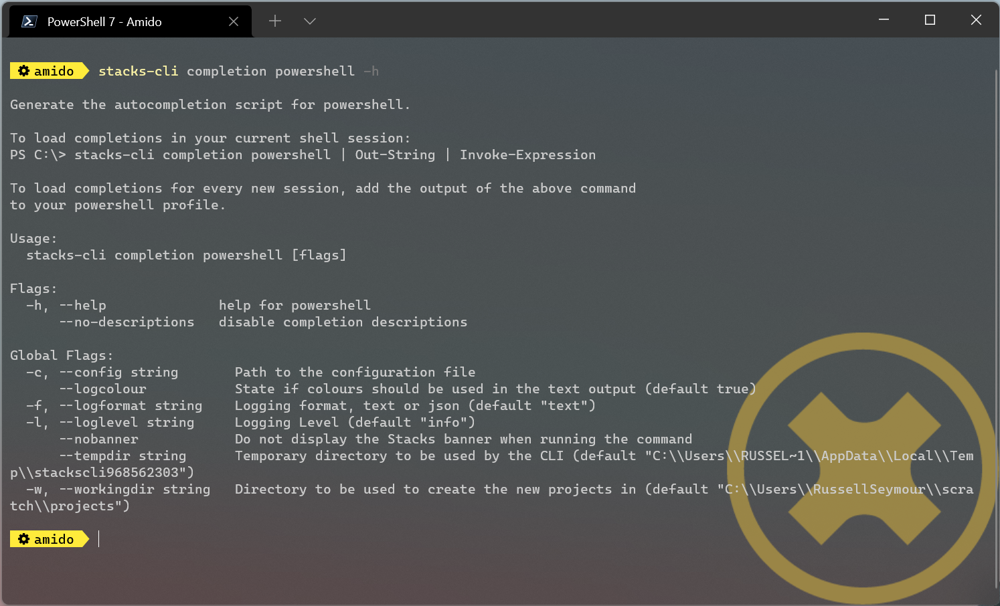

= Using the CLI

The Ensono Stacks CLI is built using Go, which means that it is a single binary that can be downloaded and run without the need to install it. It is currently built for the following platforms:

image:./images/icons/windows.png[Windows] Windows

image:./images/icons/apple.png[Mac OS] Mac OS

image:./images/icons/linux.png[Linux] Linux

The CLI will download the specified projects and run a series of operations to customize them according to the user's requirements. The steps that are to be performed in each project are governed by a project settings file, which by default is called `stackscli.yml`.

== Installation

Visit the link:https://github.com/Ensono/stacks-cli/releases[Ensono Stacks CLI] release page and download the latest version for your machine.

Once this has been downloaded, the quickest way to get started is to place the binary somewhere on your system PATH.

== Commands

The CLI has a number of commands and various options. The easiest way to see what is available is to run the `stacks-cli` command, which will display the help page.

NOTE: The operation of the Ensono Stacks CLI is identical on every platform.

=== Completion

The completion command adds completion scripts to any of the following shells:

* bash
* fish
* powershell
* zsh

By adding the completion to the shell, it allows the [TAB] key to be used to cycle through the options of any command, making discovery of options easier and increasing efficiency.

The following command shows the help for configuring auto-completion for PowerShell:

[source,bash]
----
stacks-cli completion powershell -h
----

As can be seen from the output, the command required to load the completion script into the current shell is displayed.

=== Interactive Command

The interactive command will ask several questions about the required projects, what platform it is being run on, and cloud configuration. It will then save the output of these details to a configuration file that can then be read by the `scaffold` command. This file can also be reused if the projects need to be recreated from scratch again.

[source,bash]
----
stacks-cli interactive
----

The CLI allows properties to be set that influence the way that the project is scaffolded. Up to five of these properties can be set. However, the interactive command only asks once if properties are required. To set more than one property, please separate the values using a comma.

=== Scaffold

The `scaffold` command is the main command that will be used. This downloads the specified projects, customizes them, and sets them up in the specified directory. To see the help for this command, run the following:

[source,bash]
----
stacks-cli scaffold -h
----

== Validation

The CLI will validate certain inputs to make sure that they are valid for use with the scaffolding commands as defined by the project settings.

In some cases, the CLI will modify the inputs, for example, if a space is present in the company name, it will be replaced with an underscore:

- "My Company" → "My_Company"
- "My Fantastic Company" → "My_Fantastic_Company"
- "My Company" → "My_Company"

== Command Availability Checks

Each framework has a list of commands associated with it. This denotes the list of commands that it can run during the configuration of the project.

When the application runs, it will determine the frameworks that have been selected in the projects and perform a check to see if those commands are available on the machine. It does this by checking the PATH variable for the command. This check is performed very early on in the process so it does not cause an issue when iterating around the projects that need to be set up.

NOTE: It is not possible for the Ensono Stacks project to specify the full path to the command because it can be different on each and every machine that the Ensono Stacks CLI will run on.

The commands for each of the supported frameworks are as follows:

[col="a,a"]
|===
| Framework | Commands

| dotnet | `dotnet`
| java | `java`
| Nx | `node`, `npx`
|===

If a command cannot be located, the CLI will be terminated. This does not mean the command does not exist on the machine, rather that it is not accessible using the PATH environment variable. The Ensono Stacks CLI is not a package manager and as such will not attempt to install the missing commands.

The following screenshot shows the output of a scaffolding run where the "dotnet" framework has been specified and the `dotnet` command cannot be found:

image::images/stackscli-framework-cmd-availability.png[Checking availability for framework commands]

If multiple frameworks have been set by specifying multiple projects, each framework's commands will be checked for availability.

NOTE: Although the screenshot shows the detection of the framework commands when running from a configuration file, the same checks are performed when with arguments on the command line.

== Logging

The Ensono Stacks CLI is designed to be as simple and efficient to use as possible, however there are cases when it is useful to gewt more information from the CLI when it is being run.

Bu default the CLI runs with `info` level logging, which means that simple messages about what is happening are displayed. If an error occurs within the CLI itself then this will be displayed, however when the CLI runs an external command, as is the case when it runs configuration from a project, and it fails you may see messages similar to the following:

image::./images/stackscli-op-error.png[Errors from the operations that the CLI runs]

This is not terribly helpful to understand what is happening. This is ocurring because the CLI is running other commands that are outputting to `stderr` which the CLI does not show by default. To change this behaviour change the logging to `debug` or `trace` and the output will no include all of the commands that are being run as well any output on `stdout`.

image::./images/stackscli-op-debug.png[Showing commands using debug log level]

== Connectivity Check

As the CLI relies heavily on being able to contact GitHub, it checks to see if the `github.com` domain can be resolved. It does this as one of the first checks it performs. If it cannot resolve the address then it will terminate execution with an error similar to the following.

image::./images/stackscli-connectivity-check.png[Ensono Stacks CLI failed connectivity check]

== CLI Version Check

The Ensono Stacks CLI is constantly evolving and as such there are new versions being released frequently. To help ensure that you are running the most up to date version, it will check the releases for the CLI and compare that version against the one that you are running. If there is a mismatch then the CLI will inform you of the newer version.

NOTE: This check does not prevent normal operation if you have an older version. However you _may_ find that some things do not work as you intend.

This is a simple version check, it does not update the CLI for you, but does provide a link to the latest version for download and information purposes.

The version check can be turned off using the `--nocliversion` option or the `options.nocliversion` in a configuration file or using the `ENSONOSTACKS_OPTIONS_NOCLIVERSION` environment variable.
