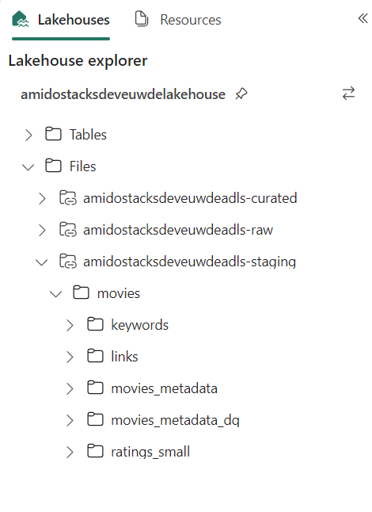

= Fabric Lakehouse Deployment
:id: fabric_deployment_guide
:description: Deployment of Microsoft Fabric Lakehouse through Azure Portal
:keywords: data, infrastructure, adf, cicd, fabric

Microsoft Fabric can be used to implement a link:../data_engineering/data_engineering_intro_azure.adoc#lakehouse-approach[lakehouse] layer over a Stacks data platform, giving full analytics capabilities over the data lake, and native integrations with tools such as Power BI.

.FABRIC PREVIEW
[NOTE]
====
At the time of writing, Fabric is in link:https://learn.microsoft.com/en-us/fabric/get-started/preview[public preview].

Some features are not currently supported, for example connecting to data lake storage behind a firewall or virtual network (which is the recommended approach in Ensono Stacks). Once additional key features such as this become available, this documentation will be updated and closer integrations with Ensono Stacks can be implemented.

Please refer to link:https://learn.microsoft.com/en-us/fabric/[Microsoft documentation] for the latest updates on Fabric and full documentation.
====

== Step 1: Create Fabric capacity resource

The first step in setting up a Fabric Workspace is provisioning a capacity resource. Before proceeding, please refer to the official documentation for further details on link:https://learn.microsoft.com/en-us/fabric/enterprise/licenses#capacity-license[capacity licenses].

To set up a capacity resource in the Azure portal:

. Login to Azure portal, search for Microsft Fabric (preview) and select Create.
. Create a Fabric capacity:
    .. Select the subscription and resource group for the Fabric capacity.
    .. Enter a name to identify the capacity resource (this is displayed in the Microsoft Fabric admin portal and Azure portal). The name must be unique in the selected location.
    .. Select a resource size, based upon your requirements.
    .. Enter a Fabric capacity administrator. The capacity administrator must be a member user or a service principal in your AAD tenant.

image::../images/fabric_create.png[]

== Step 2: Create a Microsoft Fabric Workspace

Workspaces are places to collaborate with colleagues to create collections of items such as lakehouses, warehouses, and reports. please refer below Microsoft link for details on link:https://learn.microsoft.com/en-us/fabric/get-started/workspaces[Fabric workspaces]. You may create a workspace per environment, to align to your data platform. To set up a Fabric workspace:

. Go to link:https://app.fabric.microsoft.com[https://app.fabric.microsoft.com] and sign-in to your organization's portal. You will need a Power BI Pro license and workspace admin rights on your account to create workspaces.
. Select the *Data Engineering* 'experience' from the left plane. Select *Workspaces* from the left pane, then the *New Workspace* button.
. Enter the name of the workspace as per your naming conventions (e.g. `ensono-stacks-dev-euw-fabric`). Under advanced options choose *Fabric capacity* for license mode.
. Choose the Azure Fabric capacity resource created in Step 1 and select *Apply*.

image::../images/fabric_choose_fabric.png[]

== Step 3: Create a Lakehouse

We will be creating a link:https://learn.microsoft.com/en-us/fabric/data-engineering/lakehouse-overview[Fabric Lakehouse] to access the data in our data lake. To create the lakehouse:

* Within the newly created workspace, select *New Lakehouse (Preview)* and enter a name for the lakehouse.

== Step 4: Create Lakehouse Files shortcut

In our Fabric lakehouse, we will be creating both Files and Tables shortcuts to our data lake storage containers:

* Files shortcuts will allow us to access all objects in the data lake (regardless of file type). This allows the data to be accessed through <<fabric-notebooks, Fabric notebooks>>.
* Tables shortcuts can be created over Delta Lake format tables (as we have in the Silver and Gold layers of our data lake). Once added as Tables, we can run <<sql-endpoint, SQL queries>> and use the data in <<power-bi, Power BI>>.

See the link:https://learn.microsoft.com/en-us/fabric/onelake/onelake-shortcuts[overview of OneLake shortcuts] for further information on the types of shortcut.

.SECURE DATA LAKE ACCESS
[NOTE]
====
As mentioned above, it is currently not possible to connect to data lake storage behind a firewall or virtual network (which is the recommended approach in Ensono Stacks). Therefore, you can currently only connect to data lake storage which is accessible from public networks. Once this functionality is available in Fabric, these instructions will be updated.
====

. Within the lakehouse, right-click on *Files* in the left side pane and choose *New shortcut*.
. Under *External sources*, select *Azure Data Lake Storage Gen2*.
. Provide connection details for your ADLS storage account:
    .. Enter the URL for the ADLS Gen 2 endpoint to connect, e.g. `https://amidostacksdeveuwdeadls.dfs.core.windows.net/raw`.
    .. Under *Connection*, select Create a new connection.
    .. Set a connection name, e.g. `amidostacksdeveuwadls-raw`.
    .. For *Authentication kind*, select the method you will use for authenticating with the storage account, for example, SAS token (see documentation on link:https://learn.microsoft.com/en-us/azure/ai-services/translator/document-translation/how-to-guides/create-sas-tokens?tabs=Containers[generating SAS tokens for a storage container]).
. Set the name for the new shortcut, e.g. `amidostacksdeveuwadls-raw`. If you included the container name in the URL, the *Sub Path* should already be set (e.g. `/raw`).
. Select Create. The shortcut should now be accessible under the Files directory in the lakehouse explorer panel.
. Repeat the above steps to create a shortcut for each of the data lake containers, i.e. raw, staging, and curated.

== Step 5: Create Lakehouse Tables shortcuts

Tables shortcuts will allow us to interact with query and interact with data stored in Delta Lake format. At present, external tables must be added as shortcuts individually to be fully accessible from the lakehouse.

Follow these steps for each of the tables in the data lake staging (silver) and curated (gold) layers:

. Within the lakehouse, right-click on *Tables* in the left side pane and choose *New shortcut*.
. Under *External sources*, select *Azure Data Lake Storage Gen2*.
. Provide connection details for your ADLS storage account:
    .. Enter the URL for the ADLS Gen 2 endpoint to connect, e.g. `https://amidostacksdeveuwdeadls.dfs.core.windows.net/staging`.
    .. You may re-use the connection to this container created in the previous step.
. Set the name for the new table shortcut, e.g. `staging_movies_links`. In the *Sub Path* provide the path to the Delta table directory in the container (e.g. `/staging/movies/links`).
. Select Create. The shortcut should now be accessible under the Tables directory in the lakehouse explorer panel.
. Repeat the above steps to create a table shortcut for each of the tables required in the staging and curated containers.

image::../images/fabric_tables_shortcut.png[]

== Step 6: Interacting with data in the lakehouse

Once shortcuts have been added, data in the Lakehouse can be used within Fabric in a number of ways:

=== SQL Endpoint [[sql-endpoint]]

Tables in the lakehouse can be directly queried via the link:https://learn.microsoft.com/en-us/fabric/data-engineering/lakehouse-sql-endpoint[SQL endpoint].

1. Within the lakehouse, select the *Lakehouse* button from the top right corner, and select *SQL Endpoint*.
2. From here, all tables added as shortcuts will appear as tables in the SQL Endpoint, within the default schema. You can query the tables using SQL. See documentation on the link:https://learn.microsoft.com/en-us/fabric/data-warehouse/sql-query-editor[SQL query editor] for more details.

TIP: Tables in the Lakehouse are read-only via the SQL endpoint. Views can be created.

=== Power BI [[power-bi]]

Tables and views in the lakehouse integrate seamlessly with Power BI. Direct lake mode provides a default Power BI dataset from Tables in the lakehouse. See further information on link:https://learn.microsoft.com/en-us/fabric/data-warehouse/datasets[Power BI datasets in Fabric].

=== Notebooks [[fabric-notebooks]]

link:https://learn.microsoft.com/en-us/fabric/data-engineering/how-to-use-notebook[Fabric notebooks] offer Apache Spark code development over the Lakehouse. Unlike the SQL endpoint, which can only query lakehouse Tables, using Fabric notebooks, you can also interact with lakehouse Files shortcuts. Within your Fabric notebooks, the path to items in the lakehouse is simply `Files/` or `Tables/`, for example:

[source]
----
// Load data directly from Files
df = spark.read.format("delta").load("Files/amidostacksdeveuwdeadls-staging/movies/movies_metadata_dq")

// Display data
display(df.limit(10))
----
