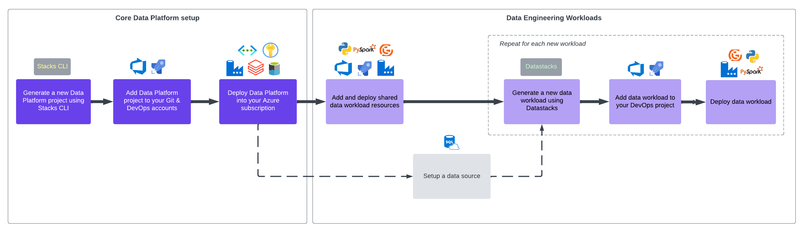

= Getting Started
:description: Getting Started with Ensono Stacks Data
:keywords: ensono stacks, data, azure

This Getting Started section provides the steps needed to get up and running with Ensono Stacks Data. It follows the link:../architecture/architecture_data_azure.adoc[Ensono Stacks Data deployment workflow].

A more link:../architecture/architecture_data_azure.adoc[detailed workflow diagram] is also available.

== Steps

1. link:./generate_project.adoc[Generate a Data Project] - Generate a new data project.
2. link:./core_data_platform_deployment_azure.adoc[Infrastructure Deployment] - Deploy the data platform infrastructure into your cloud environment.
3. link:./dev_quickstart_data_azure.adoc[Local Development Quickstart] - Once your project has been generated, set up your local environment to start developing.
4. link:./shared_resources_deployment_azure.adoc[Shared Resources Deployment] - Deploy common resources to be shared across data pipelines.
5. link:./datastacks_deployment_azure.adoc[Datastacks Build & Deployment] - Build and deploy the Datastacks Python library.
6. (Optional) link:./example_data_source.adoc[Example Data Source] - To assist with the 'Getting Started' steps, you may wish to set up the Example Data Source.
7. link:./ingest_pipeline_deployment_azure.adoc[Data Ingest Pipeline Deployment] - Generate and deploy a data ingest pipeline using the Datastacks CLI.
8. link:./processing_pipeline_deployment_azure.adoc[Data Processing Pipeline Deployment] - Generate and deploy a data processing pipeline using the Datastacks CLI.
9. link:./fabric_deployment_guide.adoc[Fabric Lakehouse Deployment] - Steps to implement a Microsoft Fabric Lakehouse over the data platform.
