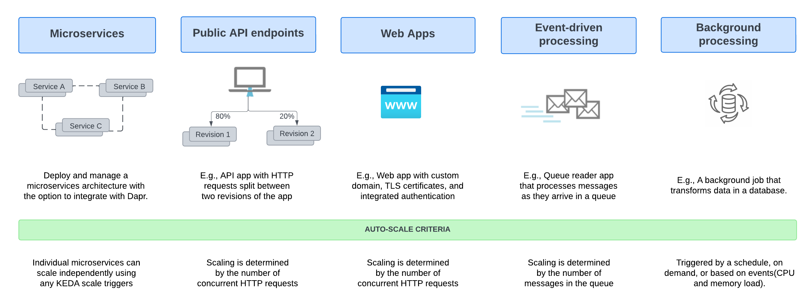
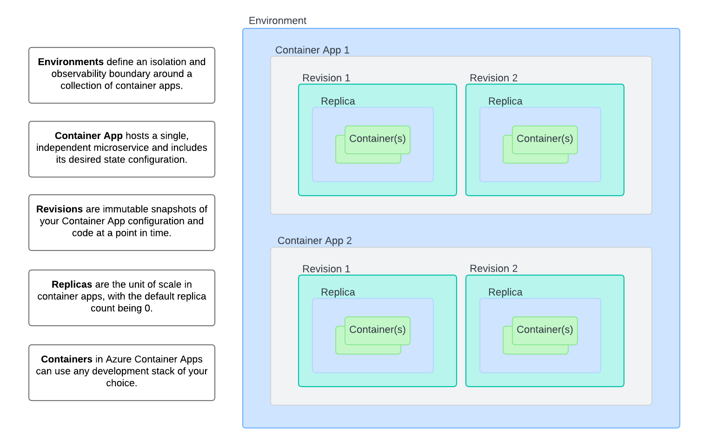
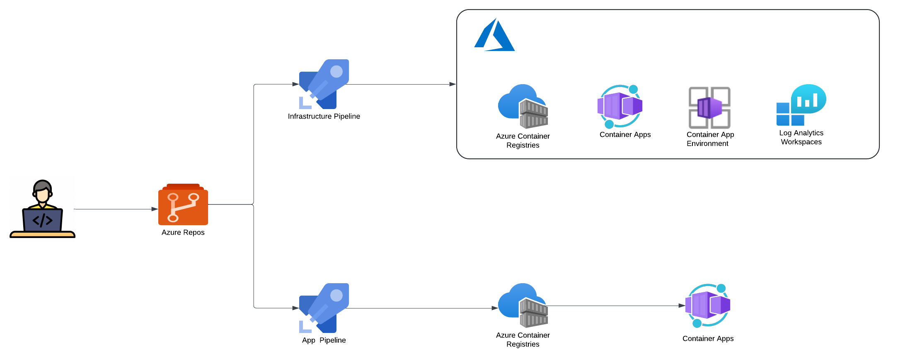
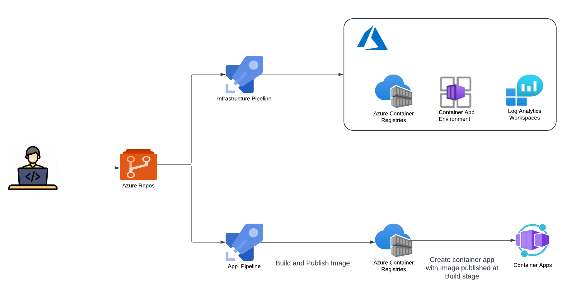

# Azure Container Apps

Azure Container Apps(ACA) is a fully managed serverless container service for building and deploying modern apps at scale - without managing infrastructure. It is builds on top of Kubernetes, offering a fully managed experience for deploying containerized applications without requiring direct access to Kubernetes APIs or cluster management.

Common uses of Azure Container Apps include:

- Deploying API endpoints
- Hosting background processing jobs
- Handling event-driven processing
- Running microservices

# Azure Container Apps Components / Infrastucture Overview

Azure Container Apps consists of two primary components:

- Container Apps Environment 

    - This component allows you to specify the infrastructure for deploying your container app. 
    - A secure boundary around one or more container apps and jobs.
    - Defines shared settings for networking, logging, and other services.

- Container App

    - A Container App hosts a single, independent microservice and includes its desired state configuration.
    - Utilizes containers from public registries (e.g., Docker Hub) or private registries (e.g., Azure Container Registry).

- More settings

  - **Ingress**: Azure Container Apps supports both HTTP and HTTPS ingress. The ingress controls how external traffic reaches your container apps and allows you to configure custom domains, SSL/TLS certificates, authentication, and authorization.
  - **Networking rules**: You can define networking rules to manage how your application communicates internally and with the outside world. This includes securing connections and integrating with private networks for enhanced security.
  - **Persistent storage**: Azure Container Apps allows you to attach Azure Storage accounts as volumes in your containers, enabling your application to access persistent storage for data that needs to be preserved across container instances or revisions.
  - **Secrets management**: If your application uses secrets, you can inject them   into your containers either from Azure Key Vault or defined directly in the Container App settings. This ensures secure storage and access to sensitive  information.
  - **Managed identity**: You can assign a managed identity to your container   app, allowing it to securely access other Azure services without the need   for explicit credentials.
  - **Logging and monitoring**: Azure Container Apps integrates with Azure   Monitor for logging and monitoring. You can configure log collection and  set up alerts to gain insights into your application's performance and   health.
  - **Health probes**: You can define liveness and readiness probes to monitor  the health of your containers. These probes help ensure that your  application is functioning correctly and can handle incoming requests.

# Azure Container Options Comparison

| Feature/Service | Azure Container Apps | Azure App Service | Azure Container Instances | Azure Kubernetes Service | Azure Functions |
|-----------------|:--------------------:|:------------------:|:-------------------------:|:-------------------------:|:----------------:|
| Primary Use Case | Serverless microservices and jobs | Web applications and APIs | Single pod of containers on demand | Full Kubernetes orchestration | Event-driven functions |
| Kubernetes-based | Yes (abstracted) | No | No | Yes (full access) | No |
| Serverless | Yes | Partially | Yes | No | Yes |
| Event-driven scaling | Yes | Limited | No | Manual/custom | Yes |
| Direct K8s API access | No | No | No | Yes | No |
| Microservices support | Strong | Limited | Limited | Strong | Limited |
| Web-optimized | Yes | Yes | No | Can be configured | Partially |
| Container support | Yes | Yes | Yes | Yes | Yes (as option) |
| Managed service | Fully managed | Fully managed | Fully managed | Managed control plane | Fully managed |
| Best for | General-purpose containers, microservices | Web apps, APIs | Low-level container instances | Teams requiring full K8s control | FaaS, event-driven apps |

### Notes

- This table provides a high-level comparison of the main features and use cases for each Azure container service.
- For detailed information on each service, refer to the official Azure documentation.

# CICD Strategy
 
The deployment strategy can be segmented into two parts:
- Infrastructuure Deployment
- App Deployment

## Option 1 - Container App Enviornment and Container App deployment via Infrastructure pipeline

This approach involves deploying both the Container App Environment and Container App through the infrastructure pipeline, with application code deployed to the Container App via a separate application deployment pipeline.

    STACKS-INFRASTRUCTURE-ACA
    ├── .github              # GitHub-specific configurations and workflows
    ├── cicd
    │   └── build            # CI/CD build configurations
    │       ├── azDevOps     # Azure DevOps specific build configurations
    │       ├── config       # Configuration files for the build process
    │       ├── scripts      # Build-related scripts
    │       └── taskctl      # TaskCTL configurations for the build process
    ├── deploy
    │   └── azure            # Terraform configurations for the Core Infra deployment including Container App
    ├── src
    │   ├── app              # Application source code
    │   └── aca-vars.yml     # Variables specific to Azure Container App
    │   └── deploy-aca.yml   # Deployment configuration for Azure Container App
    ├── .gitattributes       # Git attributes file
    ├── .gitignore           # Git ignore file
    ├── LICENSE              # License file for the project
    ├── README.md            # Main readme file with project documentation
    └── taskctl.yaml         # TaskCTL configuration file

Pro's
- Centralized infrastructure code management.

Con's
- Requires initial Container App provisioning with a public image, creating an unnecessary first revision
- Potential discrepancies between infrastructure-defined image tags and application deployment updates
- Additional maintenance overhead to keep infrastructure and application deployment configurations in sync

## Option 2 - Container App Environment deployment via Infrastructure pipeline, Container App deployment via Application pipeline

This approach separates the deployment of the Container App Environment and the Container App itself:

-  Infrastructure Deployment Pipeline:
   -  Deploys Container App Environment and other required resources.
   -  Does not provision the Container App at this stage.

-  Application Deployment Pipeline:
   - Builds application code and publishes the image to the container registry.
   - Provisions the Container App using Terraform with the newly created image.

    STACKS-INFRASTRUCTURE-ACA
    ├── .github              # GitHub-specific configurations and workflows
    ├── cicd
    │   └── build            # CI/CD build configurations
    │       ├── azDevOps     # Azure DevOps specific build configurations
    │       ├── config       # Configuration files for the build process
    │       ├── scripts      # Build-related scripts
    │       └── taskctl      # TaskCTL configurations for the build process
    ├── deploy
    │   └── azure            # Terraform configurations for the Core Infra deployment excluding Container App
    ├── src
    │   ├── app              # Application source code
    │   └── terraform        # Terraform configurations for the application (Container App)
    │   └── aca-vars.yml     # Variables specific to Azure Container App
    │   └── deploy-aca.yml   # Deployment configuration for Azure Container App
    ├── .gitattributes       # Git attributes file
    ├── .gitignore           # Git ignore file
    ├── LICENSE              # License file for the project
    ├── README.md            # Main readme file with project documentation
    └── taskctl.yaml         # TaskCTL configuration file

Pro's

- Eliminates the need for initial Container App provisioning with a public image.
- Avoids unnecessary revisions in the Container App.
- Facilitates easier maintenance and version control of container images.
- Provides loose coupling in Container App deployment.
- Allows for more precise control over image versions used in deployments.
- Aligns infrastructure provisioning more closely with application lifecycle.
- Enables application-specific configurations: Each individual Container App can have different liveness and readiness probes, scaling rules, and ingress settings (such as ingress port) that are more closely aligned with application requirements. This allows each Container App team to define these settings independently in their application deployment  pipeline, providing greater flexibility and customization.

Con's
- Requires separate management of Terraform code for each individual Container App

## Recommendation
We recommend implementing Option 2: Container App Environment deployment via Infrastructure pipeline and Container App deployment via Application pipeline. This approach provides the flexibility to manage infrastructure and application deployments separately while optimizing the deployment process for Azure Container Apps.
This recommendation will result in a more streamlined deployment process, eliminating unnecessary Container App revisions and allowing for tighter integration between application builds and deployments. 

However, it's important to note that this approach will require additional effort in managing separate Terraform configurations for each Container App. To mitigate this challenge, we will utilize the existing Azure Container Apps Terraform module developed by Ensono, which is available [here](https://registry.terraform.io/modules/Ensono/aca/azurerm/latest).

This pre-built module will help reduce duplication and ease maintenance across multiple Container Apps, standardizing our Container App deployments and reducing the overhead of managing individual Terraform configurations.
By leveraging this existing module in our recommended approach, we can achieve a more efficient and manageable deployment strategy for our Azure Container Apps while maintaining the flexibility to evolve both infrastructure and applications independently.

# ACA vs AKS: A Comparative Analysis / How does ACA compare to AKS?

| Feature | Azure Kubernetes Service (AKS) Infrastructure focus, higher flexibility | Azure Container Apps (ACA) Application focus, infrastructure abstraction |
|---------|-----------------------------------------------------------------------------------|----------------------------------------------------------------------------------|
| Primary Offering | Azure-managed Kubernetes environment with comprehensive API access and granular cluster management, utilizing a node-centric pricing structure | Fully-managed serverless abstraction on top of Kubernetes infrastructure, purpose built for managing and scaling event-driven microservices with a consumption-based pricing model |
| Key Strengths | • Aligned with upstream Kubernetes, offering managed control plane • Operations flexibility with advanced customization • Ideal for teams with Kubernetes expertise | • Platform-as-a-Service experience with serverless scale • Enhanced developer efficiency through reduced operational complexity • Optimized for Linux-based, general-purpose stateless container deployments |
| Deployment Approach | • Admins set up node-based AKS clusters via Azure Portal, CLI, or IaC • Developers use Kubernetes manifests or Helm for container deployment in isolated namespaces | • Direct container deployment as Container Apps through Azure Portal, CLI, or IaC • No Kubernetes manifest knowledge required • Apps grouped in shared environments, similar to Kubernetes namespaces |
| Open Source Tools | • Extendable with various cluster add-ons (e.g., Dapr, KEDA, Service Mesh) • Supports custom component installation using Kubernetes manifests | Includes opinionated platform capabilities powered by CNCF projects including Dapr, KEDA and Envoy which are fully platform-managed and supported • Envoy: managed ingress and traffic splitting • KEDA: managed, event-driven autoscale • Dapr: codified best practices for microservices  |

# Upgrade Path: Azure Container Apps to Azure Kubernetes Service

High-level upgrade path from Azure Container Apps to Azure Kubernetes Service.

Application code and container images remain largely unchanged in this migration. The primary focus is on the infrastructure and deployment mechanisms, not the application internals. Minor adjustments to application configurations may be needed to align with Kubernetes-specific environment variables or service discovery methods.

1. Assessment and Planning
   - Review current microservices architecture and ACA-specific features in use
   - Identify necessary Kubernetes features for AKS migration
   - Plan changes for CI/CD pipelines

2. Infrastructure Preparation
   - Set up AKS cluster (using Terraform or Azure CLI)
   - Configure networking (VNets, subnets)
   - Set up or integrate existing Azure Container Registry (ACR)

3. Kubernetes Manifest Creation / Service migration
   - Begin with non-critical services
   - Convert ACA configurations to Kubernetes manifests (Deployments, Services, Ingress)
   - Set up Dapr on AKS if previously used in ACA
   - Translate ACA scaling rules to Kubernetes Horizontal Pod Autoscaler (HPA)

4. CI/CD Pipeline Updates
   - Update pipelines to deploy to AKS
   - Implement Kubernetes-specific deployment strategies (rolling updates, blue-green deployments)

5. Testing
    - Thoroughly test each migrated service in AKS environment
    - Perform load testing to ensure performance

6. Gradual Transition and Decommissioning
    - Decommission ACA environment after successful migration and stabilization

Additional points to consider during upgrade/ migration:-
- Networking and Service Discovery
- State and Data Migration
- Monitoring and Logging
- Security
- Secrets Management

**Note:** This upgrade path is a high-level guide. The actual process may vary based on specific implementation details and requirements. Thorough planning, gradual migration, and extensive testing at each step are crucial for a successful transition.
