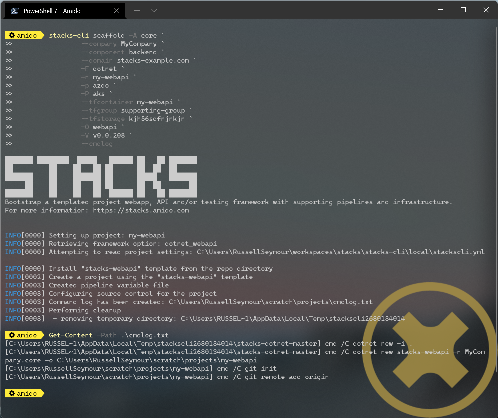
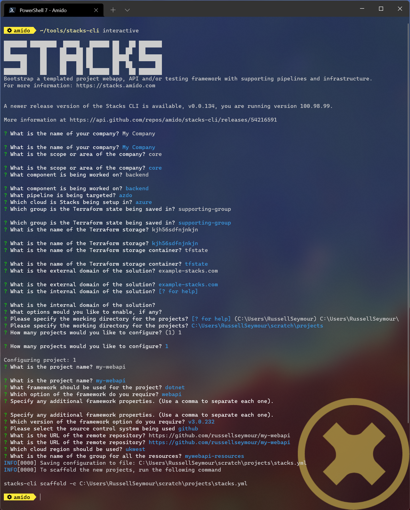
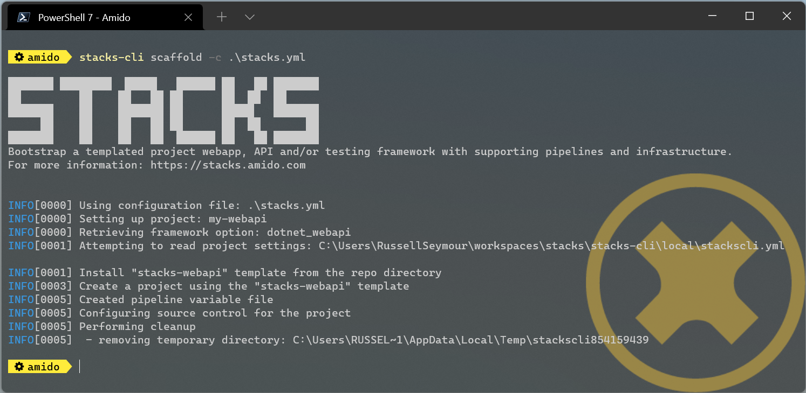
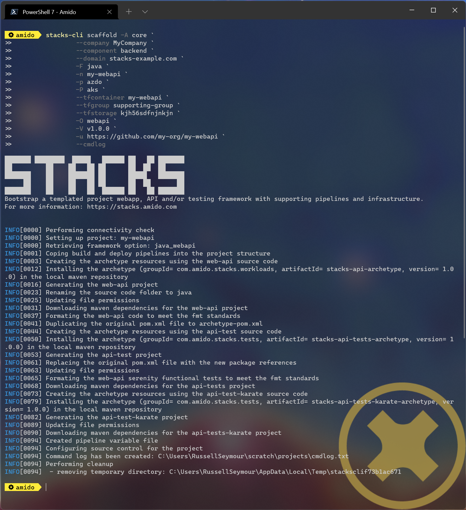
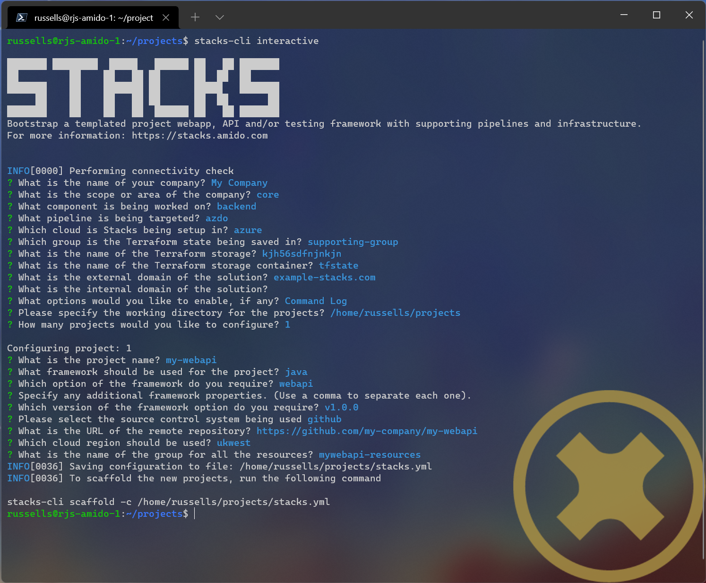
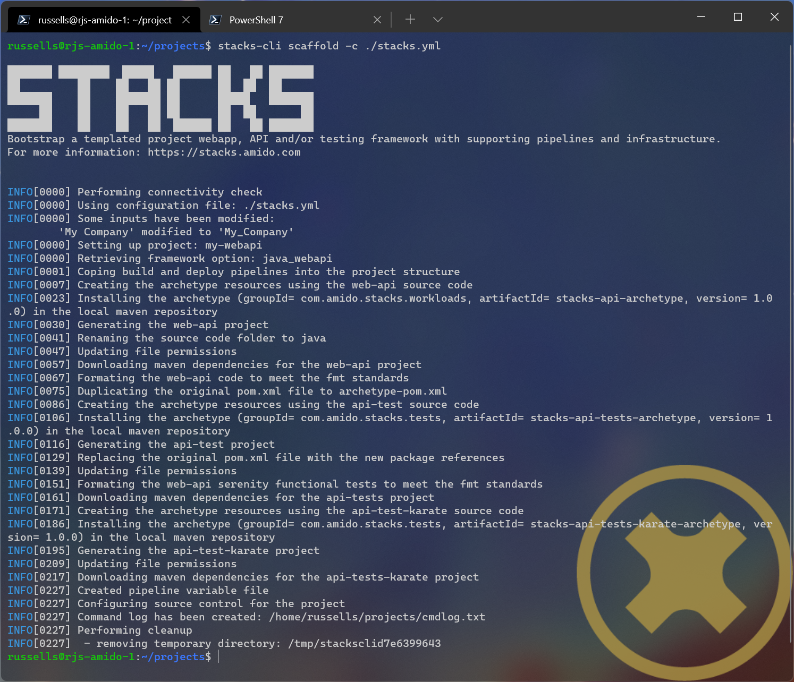
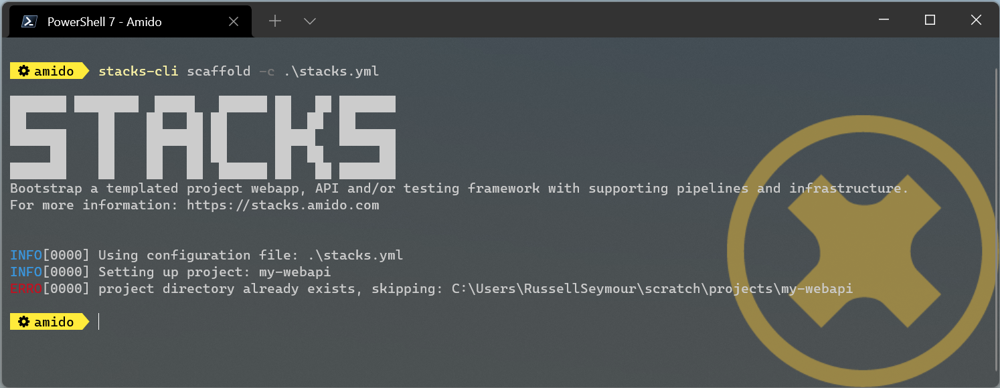
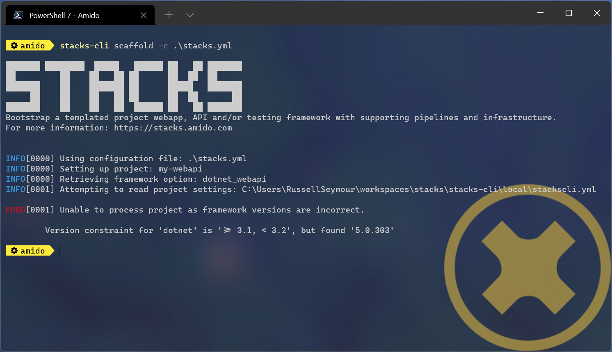
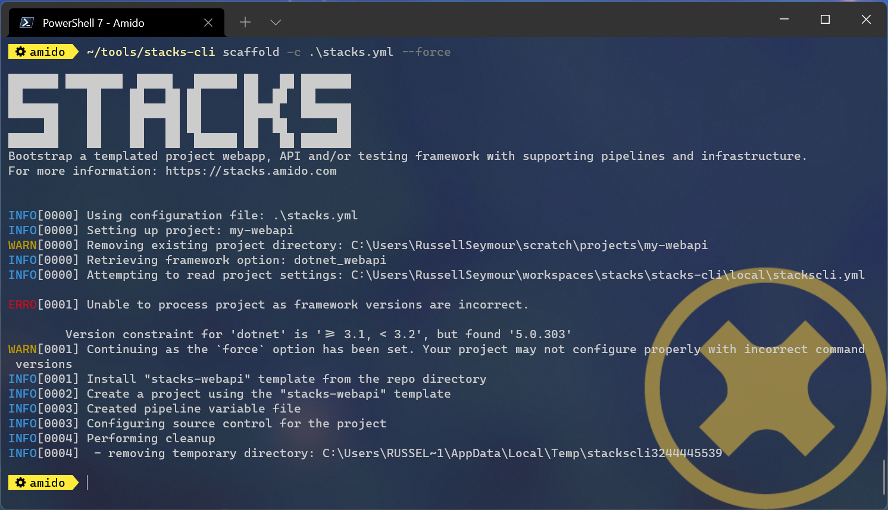

# Examples

This section provides some examples on how to run the CLI to setup a project from the Amido Stacks projects.

> **Note**
> 
> It is assumed that the Stacks CLI command has been installed and is in the path to be called using the `stacks` name.

The following table shows the settings that are being used in each of the examples.

<table>
<caption>Example settings</caption>
<colgroup>
<col style={{ width: '33%' }} />
<col style={{ width: '33%' }} />
<col style={{ width: '33%' }} />
</colgroup>
<thead>
<tr className="header">
<th>Name</th>
<th>Value</th>
<th>Description</th>
</tr>
</thead>
<tbody>
<tr className="odd">
<td><p>company</p></td>
<td><p><code>MyCompany</code></p></td>
<td><p>Name of the company that the project is being created for</p></td>
</tr>
<tr className="even">
<td><p>area</p></td>
<td><p><code>core</code></p></td>
<td><p>The area within the company that the project is relevant to.</p>
<p>In previous versions of the CLI, this has been referred to as the domain, but it has been changed to area to avoid confusion with DNS domain.</p></td>
</tr>
<tr className="odd">
<td><p>component</p></td>
<td><p><code>backend</code></p></td>
<td><p>Component that the project is for</p></td>
</tr>
<tr className="even">
<td><p>domain</p></td>
<td><p><code>stacks-example.com</code></p></td>
<td><p>DNS domain for which the application will respond to</p></td>
</tr>
<tr className="odd">
<td><p>cloud</p></td>
<td><p><code>azure</code></p></td>
<td><p>The cloud platform being used</p></td>
</tr>
<tr className="even">
<td><p>region</p></td>
<td><p><code>ukwest</code></p></td>
<td><p>Region in the cloud that the resources will be deployed to</p></td>
</tr>
<tr className="odd">
<td><p>group</p></td>
<td><p><code>mywebapi-resources</code></p></td>
<td><p>Group that holds all of the cloud resources</p></td>
</tr>
<tr className="even">
<td><p>tfgroup</p></td>
<td><p><code>supporting-group</code></p></td>
<td><p>Group that has the resources to be used to hold the Terraform state</p></td>
</tr>
<tr className="odd">
<td><p>tfstorage</p></td>
<td><p><code>kjh56sdfnjnkjn</code></p></td>
<td><p>Name of the storage that will hold the Terraform state</p></td>
</tr>
<tr className="even">
<td><p>tfcontainer</p></td>
<td><p><code>tfstate</code></p></td>
<td><p>Container in the storage for the state files</p></td>
</tr>
<tr className="odd">
<td><p>name</p></td>
<td><p><code>my-webapi</code></p></td>
<td><p>Name of the project to create in the working directory</p></td>
</tr>
<tr className="even">
<td><p>framework_option</p></td>
<td><p><code>webapi</code></p></td>
<td><p>The option within the framework being created.</p>
<p>For <code>dotnet</code> or <code>java</code> the options are <code>webapi</code>, <code>cqrs</code> or <code>events</code>. For <code>infra</code> the options are <code>aks</code>.</p></td>
</tr>
</tbody>
</table>

## .NET

The following table shows the additional options that are required when scaffolding the .NET examples.

| Name               | Value      | Description                                            |
| ------------------ | ---------- | ------------------------------------------------------ |
| framework          | `dotnet`   | Framework being used, e.g. `dotnet`, `java` or `infra` |
| framework\_version | `v6.0.274` | Version of the framework option to grab.               |

.NET Specific settings

### .NET WebApi project from command line

Run the following command to create the new project in the working directory, which will be the directory that the command is being run in.

<table>
<colgroup>
<col style={{ width: '50%' }} />
<col style={{ width: '50%' }} />
</colgroup>
<thead>
<tr className="header">
<th>Bash</th>
<th>PowerShell</th>
</tr>
</thead>
<tbody>
<tr className="odd">
<td><div className="sourceCode" id="cb1"><pre className="sourceCode bash"><code className="sourceCode bash"><a className="sourceLine" id="cb1-1" title="1"><span className="ex">stacks-cli</span> scaffold -A core \</a>
<a className="sourceLine" id="cb1-2" title="2">                --company MyCompany \</a>
<a className="sourceLine" id="cb1-3" title="3">                --component backend \</a>
<a className="sourceLine" id="cb1-4" title="4">                --domain stacks-example.com \</a>
<a className="sourceLine" id="cb1-5" title="5">                -F dotnet \</a>
<a className="sourceLine" id="cb1-6" title="6">                -n my-webapi \</a>
<a className="sourceLine" id="cb1-7" title="7">                -p azdo \</a>
<a className="sourceLine" id="cb1-8" title="8">                -P aks \</a>
<a className="sourceLine" id="cb1-9" title="9">                --tfcontainer my-webapi \</a>
<a className="sourceLine" id="cb1-10" title="10">                --tfgroup supporting-group \</a>
<a className="sourceLine" id="cb1-11" title="11">                --tfstorage kjh56sdfnjnkjn \</a>
<a className="sourceLine" id="cb1-12" title="12">                -O webapi \</a>
<a className="sourceLine" id="cb1-13" title="13">                -V v6.0.274 \</a>
<a className="sourceLine" id="cb1-14" title="14">                --cmdlog</a></code></pre></div></td>
<td><div className="sourceCode" id="cb2"><pre className="sourceCode powershell"><code className="sourceCode powershell"><a className="sourceLine" id="cb2-1" title="1">stacks-cli scaffold -A core `</a>
<a className="sourceLine" id="cb2-2" title="2">                --company MyCompany `</a>
<a className="sourceLine" id="cb2-3" title="3">                --component backend `</a>
<a className="sourceLine" id="cb2-4" title="4">                --domain stacks-example.<span className="fu">com</span> `</a>
<a className="sourceLine" id="cb2-5" title="5">                -F dotnet `</a>
<a className="sourceLine" id="cb2-6" title="6">                -n my-webapi `</a>
<a className="sourceLine" id="cb2-7" title="7">                -p azdo `</a>
<a className="sourceLine" id="cb2-8" title="8">                -P aks `</a>
<a className="sourceLine" id="cb2-9" title="9">                --tfcontainer my-webapi `</a>
<a className="sourceLine" id="cb2-10" title="10">                --tfgroup supporting-group `</a>
<a className="sourceLine" id="cb2-11" title="11">                --tfstorage kjh56sdfnjnkjn `</a>
<a className="sourceLine" id="cb2-12" title="12">                -O webapi `</a>
<a className="sourceLine" id="cb2-13" title="13">                -V v6.<span className="fu">0</span>.<span className="fu">274</span> `</a>
<a className="sourceLine" id="cb2-14" title="14">                --cmdlog</a></code></pre></div></td>
</tr>
</tbody>
</table>

This will get the specified version of the framework project, create a new project based on the options specified and then update the build files to work with those settings. Finally it will initalise a new git repository in the new project directory. All of the commands that have been run by the CLI will be saved in the `cmdlog.txt` file in the directory that the command was run in.



[Figure 1](#example_cli_cmdline) shows the output of the command running in PowerShell. It also shows the commands that have been run in the `cmdlog.txt`.

The resultant project, as stated by the `Project path:` statement in the screenshot, contains all the necessary files to run a simple .NET WebApi. The following listing shows that the solutions have been renamed with the `company` name as the namespace, as shown on lines 19, 26, 29 and 36.

``` text
└───my-webapi
    ├───.github
    ├───build
    │   └───azDevOps
    │       └───azure
    │           └───templates
    │               └───steps
    │                   └───build
    ├───contracts
    ├───deploy
    │   ├───azure
    │   │   └───app
    │   │       └───kube
    │   ├───k8s
    │   │   └───app
    │   └───scripts
    └───src
        ├───api
        │   ├───MyCompany.core.API
        │   │   ├───Authentication
        │   │   ├───Authorization
        │   │   └───Controllers
        │   │       ├───Category
        │   │       ├───DOMAIN
        │   │       └───Item
        │   ├───MyCompany.core.API.Models
        │   │   ├───Requests
        │   │   └───Responses
        │   └───MyCompany.core.API.UnitTests
        │       └───Controllers
        │           ├───Category
        │           ├───DOMAIN
        │           └───Item
        └───tests
            └───Functional
                └───MyCompany.core.API.FunctionalTests
                    ├───Builders
                    │   └───Http
                    ├───Configuration
                    ├───Models
                    └───Tests
                        ├───Fixtures
                        ├───Steps
                        └───Stories
```

### .NET WebApi project using the interactive command

The interactive command is designed to ask questions on the command line about the configuration required for setting up Amido Stacks. It will then save this configuration out to a file that can be read in using the `scaffold` command.

``` bash
stacks-cli interactive
```

The values as specified in the previous configuration table have been used in the following screenshot of the interactive session.



The resulting configuration file contains all of the configuration that was used to generate the projects, which means it can be used to produce the same project stack again.

``` yaml
log:
  level: info
  format: text
  colour: true
directory:
  working: "C:\\Users\\RussellSeymour\\scratch\\projects"
business:
  company: My Company
  domain: core
  component: backend
cloud:
  platform: azure
network:
  base:
    domain:
      external: example-stacks.com
pipeline: azdo
project:
- name: my-webapi
  framework:
    type: dotnet
    option: webapi
    version: v3.0.232
  platform:
    type: aks
  sourcecontrol:
    type: github
    url: https://github.com/russellseymour/my-webapi
  cloud:
    region: ukwest
    group: mywebapi-resources
stacks:
  dotnet:
    webapi:
      url: https://github.com/amido/stacks-dotnet
      trunk: master
    cqrs:
      url: https://github.com/amido/stacks-dotnet-cqrs
      trunk: master
    events:
      url: https://github.com/amido/stacks-dotnet-cqrs-events
      trunk: master
  java:
    webapi:
      url: https://github.com/amido/stacks-java
      trunk: master
    cqrs:
      url: https://github.com/amido/stacks-java-cqrs
      trunk: main
    events:
      url: https://github.com/amido/stacks-java-cqrs-events
      trunk: main
  nodejs:
    csr:
      url: https://github.com/amido/stacks-typescript-csr
      trunk: master
    ssr:
      url: https://github.com/amido/stacks-typescript-ssr
      trunk: master
  infra:
    aks:
      url: https://github.com/amido/stacks-infrastructure-aks
      trunk: master
terraform:
  backend:
    storage: kjh56sdfnjnkjn
    group: supporting-group
    container: tfstate
options:
  cmdlog: false
  dryrun: false
  nobanner: false
  nocliversion: false
```

The command that needs to be run next is displayed at the end of the output.

### .NET WebApi project using a configuration file

The CLI can be used with a configuration file to generate the Amido Stacks based projects.

> **Note**
> 
> The configuration file that is used in the following example is from the previous example. However, any valid configuration file can be used.

``` bash
stacks-cli scaffold -c ./stacks.yml
```

The CLI will use the configuration file to scaffold the requested projects.



As has been seen with using the scaffolding command with command line options, the resultant project has been created with the namespace set to the specified company name.

``` text
└───my-webapi
    ├───.github
    ├───build
    │   └───azDevOps
    │       └───azure
    │           └───templates
    │               └───steps
    │                   └───build
    ├───contracts
    ├───deploy
    │   ├───azure
    │   │   └───app
    │   │       └───kube
    │   ├───k8s
    │   │   └───app
    │   └───scripts
    └───src
        ├───api
        │   ├───MyCompany.core.API
        │   │   ├───Authentication
        │   │   ├───Authorization
        │   │   └───Controllers
        │   │       ├───Category
        │   │       ├───DOMAIN
        │   │       └───Item
        │   ├───MyCompany.core.API.Models
        │   │   ├───Requests
        │   │   └───Responses
        │   └───MyCompany.core.API.UnitTests
        │       └───Controllers
        │           ├───Category
        │           ├───DOMAIN
        │           └───Item
        └───tests
            └───Functional
                └───MyCompany.core.API.FunctionalTests
                    ├───Builders
                    │   └───Http
                    ├───Configuration
                    ├───Models
                    └───Tests
                        ├───Fixtures
                        ├───Steps
                        └───Stories
```

## Java

The following table shows the additional options that are required when scaffolding the Java examples.

| Name               | Value    | Description                                            |
| ------------------ | -------- | ------------------------------------------------------ |
| framework          | `java`   | Framework being used, e.g. `dotnet`, `java` or `infra` |
| framework\_version | `v1.0.0` | Version of the framework option to grab.               |

Java Specific settings

### Java WebApi project from command line

Run the following command to scaffold a new Java project based on the Amido WebApi Java project. The project will be created in the working directory, which in this case will be the directory that the command has is being run under.

<table>
<colgroup>
<col style={{ width: '50%' }} />
<col style={{ width: '50%' }} />
</colgroup>
<thead>
<tr className="header">
<th>Bash</th>
<th>PowerShell</th>
</tr>
</thead>
<tbody>
<tr className="odd">
<td><div className="sourceCode" id="cb1"><pre className="sourceCode bash"><code className="sourceCode bash"><a className="sourceLine" id="cb1-1" title="1"><span className="ex">stacks-cli</span> scaffold -A core \</a>
<a className="sourceLine" id="cb1-2" title="2">                --company MyCompany \</a>
<a className="sourceLine" id="cb1-3" title="3">                --component backend \</a>
<a className="sourceLine" id="cb1-4" title="4">                --domain stacks-example.com \</a>
<a className="sourceLine" id="cb1-5" title="5">                -F java \</a>
<a className="sourceLine" id="cb1-6" title="6">                -n my-webapi \</a>
<a className="sourceLine" id="cb1-7" title="7">                -p azdo \</a>
<a className="sourceLine" id="cb1-8" title="8">                -P aks \</a>
<a className="sourceLine" id="cb1-9" title="9">                --tfcontainer my-webapi \</a>
<a className="sourceLine" id="cb1-10" title="10">                --tfgroup supporting-group \</a>
<a className="sourceLine" id="cb1-11" title="11">                --tfstorage kjh56sdfnjnkjn \</a>
<a className="sourceLine" id="cb1-12" title="12">                -O webapi \</a>
<a className="sourceLine" id="cb1-13" title="13">                -V v1.0.0 \</a>
<a className="sourceLine" id="cb1-14" title="14">                -u https://github.com/my-company/my-webapi \</a>
<a className="sourceLine" id="cb1-15" title="15">                --cmdlog</a></code></pre></div></td>
<td><div className="sourceCode" id="cb2"><pre className="sourceCode powershell"><code className="sourceCode powershell"><a className="sourceLine" id="cb2-1" title="1">stacks-cli scaffold -A core `</a>
<a className="sourceLine" id="cb2-2" title="2">                --company MyCompany `</a>
<a className="sourceLine" id="cb2-3" title="3">                --component backend `</a>
<a className="sourceLine" id="cb2-4" title="4">                --domain stacks-example.<span className="fu">com</span> `</a>
<a className="sourceLine" id="cb2-5" title="5">                -F java `</a>
<a className="sourceLine" id="cb2-6" title="6">                -n my-webapi `</a>
<a className="sourceLine" id="cb2-7" title="7">                -p azdo `</a>
<a className="sourceLine" id="cb2-8" title="8">                -P aks `</a>
<a className="sourceLine" id="cb2-9" title="9">                --tfcontainer my-webapi `</a>
<a className="sourceLine" id="cb2-10" title="10">                --tfgroup supporting-group `</a>
<a className="sourceLine" id="cb2-11" title="11">                --tfstorage kjh56sdfnjnkjn `</a>
<a className="sourceLine" id="cb2-12" title="12">                -O webapi `</a>
<a className="sourceLine" id="cb2-13" title="13">                -V v1.<span className="fu">0</span>.<span className="fu">0</span> `</a>
<a className="sourceLine" id="cb2-14" title="14">                -u https://github.<span className="fu">com</span>/my-company/my-webapi `</a>
<a className="sourceLine" id="cb2-15" title="15">                --cmdlog</a></code></pre></div></td>
</tr>
</tbody>
</table>

This command will download version v1.0.0, from the GitHub releases for the project, into a temporary directory. It will then run the specified Maven commands from the project settings file and scaffold a new project with the specified name, in the current directory. Once the project has been setup it will be initialised as Git repository and, where applicable, set the remote origin for the repo. All of the commands that are executed by the CLI will be saved in a file called `cmdlog.txt`.



As the option to save all the commands that are executed by the CLI has been specified, the `cmdlog.txt` file for the above command is as follows.


The resultant project, as stated by the `Project path:` statement in the screenshot, contains all the necessary files to run a simple Java WebApi. The following listing shows that the solutions have been renamed with the `company` name as the namespace.

``` text
└───my-webapi
    ├───api-tests
    │   ├───.mvn
    │   │   └───wrapper
    │   └───src
    │       └───test
    │           ├───java
    │           │   └───com
    │           │       └───MyCompany
    │           │           └───core
    │           │               └───backend
    │           │                   └───tests
    │           │                       ├───menu
    │           │                       ├───models
    │           │                       ├───pact
    │           │                       │   └───pacts
    │           │                       ├───status
    │           │                       ├───stepdefinitions
    │           │                       └───templates
    │           └───resources
    │               ├───cucumber
    │               │   └───features
    │               │       └───status
    │               └───templates
    ├───api-tests-karate
    │   ├───.mvn
    │   │   └───wrapper
    │   └───src
    │       └───test
    │           ├───java
    │           │   └───org
    │           │       └───MyCompany
    │           │           └───core
    │           │               └───backend
    │           │                   └───tests
    │           └───resources
    ├───build
    │   ├───azDevOps
    │   │   └───azure
    │   │       ├───coverage
    │   │       └───templates
    │   │           └───steps
    │   │               ├───build
    │   │               └───deploy
    │   └───jenkins
    │       └───azure
    ├───deploy
    │   ├───azure
    │   │   └───app
    │   │       └───kube
    │   └───k8s
    │       └───app
    └───java
        ├───.mvn
        │   └───wrapper
        ├───src
        │   ├───main
        │   │   ├───java
        │   │   │   └───com
        │   │   │       └───MyCompany
        │   │   │           └───core
        │   │   │               └───backend
        │   │   │                   └───menu
        │   │   │                       ├───api
        │   │   │                       │   ├───v1
        │   │   │                       │   │   ├───dto
        │   │   │                       │   │   │   ├───request
        │   │   │                       │   │   │   └───response
        │   │   │                       │   │   └───impl
        │   │   │                       │   └───v2
        │   │   │                       │       └───impl
        │   │   │                       ├───domain
        │   │   │                       └───mappers
        │   │   └───resources
        │   │       └───local
        │   └───test
        │       └───java
        │           └───com
        │               └───MyCompany
        │                   └───core
        │                       └───backend
        │                           ├───actuator
        │                           ├───menu
        │                           │   ├───api
        │                           │   │   ├───v1
        │                           │   │   │   ├───dto
        │                           │   │   │   │   └───response
        │                           │   │   │   └───impl
        │                           │   │   └───v2
        │                           │   │       └───impl
        │                           │   ├───domain
        │                           │   └───mappers
        │                           └───util
        └───target
            └───classes
                └───local
```

### Java WebApi project using the interactive command

As with the .NET example, it is possible to create a configuration file interactively to scaffold out a new project Java project. This is achieved using the `interactive` sub-command.

> **Note**
> 
> The examples shown here have been run in WSL on Windows 11.

``` bash
---
stacks-cli interactive
---
```

The values specified in the example are the ones as show in the configuration table and are the same as the settings used in the Java example fo scaffolding from the command line.



The resulting configuration file contains all of the configuration that was used to generate the projects, which means it can be used to produce the same project stack again.

``` yaml
log:
  level: info
  format: text
  colour: true
  file: ""
directory:
  working: /home/russells/projects
business:
  company: My Company
  domain: core
  component: backend
cloud:
  platform: azure
network:
  base:
    domain:
      external: example-stacks.com
pipeline: azdo
project:
- name: my-webapi
  framework:
    type: java
    option: webapi
    version: v1.0.0
  sourcecontrol:
    type: github
    url: https://github.com/my-company/my-webapi
  cloud:
    region: ukwest
    group: mywebapi-resources
stacks:
  dotnet:
    webapi:
      url: https://github.com/amido/stacks-dotnet
      trunk: master
    cqrs:
      url: https://github.com/amido/stacks-dotnet-cqrs
      trunk: master
    events:
      url: https://github.com/amido/stacks-dotnet-cqrs-events
      trunk: master
  java:
    webapi:
      url: https://github.com/amido/stacks-java
      trunk: master
    cqrs:
      url: https://github.com/amido/stacks-java-cqrs
      trunk: main
    events:
      url: https://github.com/amido/stacks-java-cqrs-events
      trunk: main
  nodejs:
    csr:
      url: https://github.com/amido/stacks-typescript-csr
      trunk: master
    ssr:
      url: https://github.com/amido/stacks-typescript-ssr
      trunk: master
  infra:
    aks:
      url: https://github.com/amido/stacks-infrastructure-aks/
      trunk: master
terraform:
  backend:
    storage: kjh56sdfnjnkjn
    group: supporting-group
    container: tfstate
options:
  cmdlog: true
  dryrun: false
  nobanner: false
  nocliversion: false
```

The command that needs to be run next is displayed at the end of the output.

### Java WebApi project using a configuration file

The Amido Stacks CLI can be used with a configuration file to setup multiple projects in one go.

> **Note**
> 
> The configuration file used in this example is the one that was generated from the `interactive` command in the previous example.

> **Note**
> 
> The examples shown here have been run in WSL on Windows 11.

``` bash
stacks-cli scaffold -c ./stacks.yml
```

The CLI will use the configuration file to get all the settings required to scaffold the projects that have been requested.



As the configuration file was configured with a company name with a space in it, the CLI has modified the value so it will be compatible with the commands that need to be run. This can be seen in the output of the CLi in the above image.

``` txt
└── my-webapi
    ├── api-tests
    │   └── src
    │       └── test
    │           ├── java
    │           │   └── com
    │           │       └── My_Company
    │           │           └── core
    │           │               └── backend
    │           │                   └── tests
    │           │                       ├── menu
    │           │                       ├── models
    │           │                       ├── pact
    │           │                       │   └── pacts
    │           │                       ├── status
    │           │                       ├── stepdefinitions
    │           │                       └── templates
    │           └── resources
    │               ├── cucumber
    │               │   └── features
    │               │       └── status
    │               └── templates
    ├── api-tests-karate
    │   └── src
    │       └── test
    │           ├── java
    │           │   └── components
    │           │       └── menu
    │           └── resources
    ├── build
    │   ├── azDevOps
    │   │   └── azure
    │   │       ├── coverage
    │   │       └── templates
    │   │           └── steps
    │   │               ├── build
    │   │               └── deploy
    │   └── jenkins
    │       └── azure
    ├── deploy
    │   ├── azure
    │   │   └── app
    │   │       └── kube
    │   └── k8s
    │       └── app
    └── java
        ├── src
        │   ├── main
        │   │   ├── java
        │   │   │   └── com
        │   │   │       └── My_Company
        │   │   │           └── core
        │   │   │               └── backend
        │   │   │                   └── menu
        │   │   │                       ├── api
        │   │   │                       │   ├── v1
        │   │   │                       │   │   ├── dto
        │   │   │                       │   │   │   ├── request
        │   │   │                       │   │   │   └── response
        │   │   │                       │   │   └── impl
        │   │   │                       │   └── v2
        │   │   │                       │       └── impl
        │   │   │                       ├── domain
        │   │   │                       └── mappers
        │   │   └── resources
        │   │       └── local
        │   └── test
        │       └── java
        │           └── com
        │               └── My_Company
        │                   └── core
        │                       └── backend
        │                           ├── actuator
        │                           ├── menu
        │                           │   ├── api
        │                           │   │   ├── v1
        │                           │   │   │   ├── dto
        │                           │   │   │   │   └── response
        │                           │   │   │   └── impl
        │                           │   │   └── v2
        │                           │   │       └── impl
        │                           │   ├── domain
        │                           │   └── mappers
        │                           └── util
        └── target
            └── classes
                └── local
```

## Running scaffold command again

Due to the fact that the CLI does quite a lot of work, it will not attempt to create the projects if the project path already exists. For example, running the same command as before, without changing any of the settings will result in an error being displayed during the creation of the project.

``` bash
stacks-cli scaffold -c ./stacks.yml
```



As can be seen the CLI will not overwrite anything at the same target path.

It is possible to change this behaviour, by adding the `--force` option to the command line. This will remove any existing directory and recreate the project in its place.

> **Note**
> 
> If the project directory already exists but it is empty, e.g. it does not contain any files or directories, then the CLI will continue to use the directory and warn that it has done so.


``` bash
stacks-cli scaffold -c ./stacks.yml --force
```


## Checking Framework command versions

Each project that gets scaffolded by the CLI, has has `stackscli.yml` file which informs the CLI what to do for that project. One of the things that can be set is constraints on the version of the framework that needs to be installed.

For example take the following project settings file.

``` yaml
framework:
  name: dotnet
  commands:
    - name: dotnet
      version: ">= 3.1, < 3.2"


# Pipeline files
pipeline:
  - type: azdo
    files:
      - name: build
        path: build/azDevOps/azure/azure-pipelines-netcore-k8s.yml
      - name: variable
        path: build/azDevOps/azure/azuredevops-vars.yml
    replacements:
      - pattern: ^.*stacks-credentials-nonprod-kv$
        value: ""

# The init stage are things that are required to run before the template is run
init:
  operations:
    - action: cmd
      cmd: dotnet
      args: new -i .
      desc: Install "stacks-webapi" template from the repo directory
    - action: cmd
      cmd: dotnet
      args: new stacks-webapi -n {{ .Input.Business.Company }}.{{ .Input.Business.Domain }} -o {{ .Project.Directory.WorkingDir }}
      desc: Create a project using the "stacks-webapi" template
```

When the CLI runs it will take take the version constraint, on line 5, and compare the version of `dotnet` it finds with this constraint. The following screenshot shows this in action on a machine that has .NET version `5.0.303` installed.



It is possible to bypass this version check by using the `--force` option on the command line, but note this is a destructive operation and if the project exists at the same location as the CLI is trying to write to the original project will be deleted.

In this case the error will still be displayed, but a a warning will state that the process is continuing.



