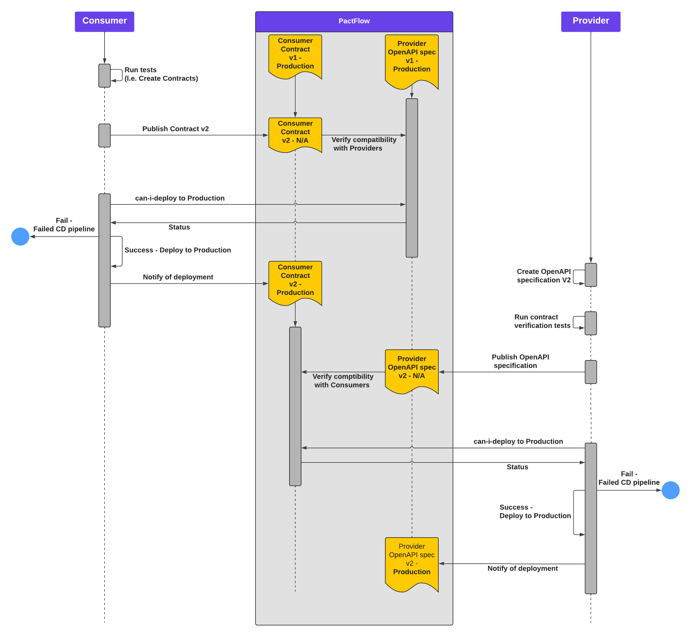

## Contract Testing the API

The [Ensono.Stacks.Templates](../../netcore/introduction_netcore) included templates for a [WebAPI](../../netcore/quickstart/web_api/create_project_netcore) and a [WebAPI with CQRS](../../netcore/quickstart/web_api_cqrs/create_project_netcore). Each of these templates will include a Provider implementation of Bi-Directional Contract Testing to accelerate teams getting started with contract testing.

### What is Bi-Directional Contract Testing

Bi-Directional Contract Testing is a type of static contract testing where two contracts - one representing consumer expectations, and another representing the provider's capability - are compared to ensure they are compatible.

> Bi-Directional contract testing replaces Consumer-Driven contract testing which is a more complicated but more thorough version of contract testing. Bi-Directional contract testing allows a provider to publish their OpenAPI specification instead of a Pact contract. When the provider and/or the consumer publish their contract, PactFlow will verify that the two contracts (consumer Pact and provider OpenAPI spec) are compatible.

The general steps for a **Provider** in Bi-Directional contract testing are as follows:

1. Create the provider contract (i.e. OpenAPI specification) either manually or generated by code
2. (Optional) The provider contract is tested against the provider itself to ensure the API satisfies the contract
3. The contract is published to PactFlow
4. Run can-i-deploy to check the compatibility with its consumers

In .Net WebAPI Stack, the OpenAPI specification is generated based upon the code, so there is no requirement for it to include verification tests (step 2) as we know the implementation and specification match.

The following diagram shows an example flow of a Bi-Directional contract testing implementation with 1 provider and 1 consumer.




### Getting Started

When creating an API project using the [Ensono.Stacks.Templates](../../netcore/introduction_netcore), the created `ci.yml` pipeline will include the steps required for Contract Testing as a provider.

Within the contract testing steps, there are a number of variables that are required. In order for the pipeline to work as expected, the variable values will need to be updated before executing the pipeline.
Variables can be found within `./build/azDevOps/azure/ci-vars.yml`

```yaml
    # Pact Contract Tests
  - name: PACT_BROKER_BASE_URL
    value: 'https://ensono-stacks.pactflow.io'
  - name: PACTICIPANT_NAME
    value: 'stacks-provider'
  - name: OAS_FILE
    value: ./src/simple-api/contracts/openapi-v1.yaml
  - name: run_contract_tests
    value: flag
```

- `PACT_BROKER_BASE_URL` needs to be updated to use a new instance of PactFlow. Details on creating a [PactFlow instance](https://pactflow.io/pricing/).
- `PACTICIPANT_NAME` should be the name of your application
- `OAS_FILE` is the relative path to the generated OpenAPI specification
- `run_contract_tests` is a flag to enable/disable all contract testing steps. This is false by default and should only be set to true once users have a new PactFlow instance.

In addition to these variables, the pipeline steps require a `PACT_BROKER_TOKEN`. This is a secret value and should be added to your pipeline as a secret environment variable.
You can get the value of this from within the Settings of your PactFlow broker instance.

### Pipeline Overview

#### Publish OpenAPI specification

In order to publish Pacts, we need to first install the Docker image. Once we have the image, we can run the `publish-provider-contract` command.

```yaml
          - task: Bash@3
            displayName: 'Contract Tests: Pull Pact CLI Docker image'
            condition: eq(variables.run_contract_test, true)
            inputs:
              targetType: inline
              script: |
                docker pull pactfoundation/pact-cli:latest

          - task: Bash@3
            displayName: 'Contract Tests: Publish OpenAPI spec to PactFlow'
            condition: eq(variables.run_contract_test, true)
            inputs:
              targetType: inline
              script: |
                docker run --rm \
                  -w ${PWD} \
                  -v ${PWD}:${PWD} \
                  -e PACT_BROKER_BASE_URL=$(PACT_BROKER_BASE_URL) \
                  -e PACT_BROKER_TOKEN=$(PACT_BROKER_TOKEN) \
                  pactfoundation/pact-cli:latest \
                  pactflow publish-provider-contract \
                  $(OAS_FILE) \
                  --provider $(PACTICIPANT_NAME) \
                  --provider-app-version $(version_number) \
                  --branch $(Build.SourceBranchName) \
                  --verification-results $(OAS_FILE) \
                  --verifier "Verification not necessary when the OpenAPI spec is generated by the API code" \
                  --tag $(version_number) $(Build.SourceBranchName) \
                  --content-type "application/yaml" \
                  --verification-exit-code 0 \
                  --verification-results-content-type "application/yaml" \
                  --verification-results-format "yaml"
            env:
              PACTFLOW_TOKEN: $(PACT_BROKER_TOKEN)
```

When the pact is being published, attributes including the branch name, version and tags are added to the command. These all help identify contracts within the PactFlow broker. These are essential to allow consumers to target the correct version of the provider contract in PactFlow when running `can-i-deploy`.

#### Execute `can-i-deploy`

`can-i-deploy` is a command provided by PactFlow that checks the state of relationships between consumers and providers registered in PactFlow. If the contracts are compatible, `can-i-deploy` will succeed, otherwise it will return a failure.
The docker image needs to be pulled here again as this is executed on a new build agent within Azure DevOps.

```yaml
      - job: canideploy_dev
        condition: eq(variables.run_contract_test, true)
        steps:
          - task: Bash@3
            displayName: 'Pull Pact CLI Docker image'
            inputs:
              targetType: inline
              script: |
                docker pull pactfoundation/pact-cli:latest

          - task: Bash@3
            displayName: 'Contract Tests: can-i-deploy to dev'
            inputs:
              targetType: inline
              script: |
                docker run --rm \
                  -e PACT_BROKER_BASE_URL=$(PACT_BROKER_BASE_URL) \
                  -e PACT_BROKER_TOKEN=$(PACT_BROKER_TOKEN) \
                  pactfoundation/pact-cli:latest \
                  broker can-i-deploy \
                  --pacticipant $(PACTICIPANT_NAME) \
                  --version $(version_number) \
                  --to-environment $(Environment.ShortName)
```

Arguments provided identify which provider and version of the contract is being validated against the registered consumer contracts. This will check the against contracts on the environment we are trying to deploy to (set in `--to-environment`).

#### Register a deployment

After we have deployed our API (with a new OpenAPI specification version), we need to let PactFlow know what environment that specification has been deployed to. This is essential when **consumers** are running `can-i-deploy` as they will need to confirm when they deploy to that environment, the contracts are compatible.

```yaml
                - task: Bash@3
                  displayName: 'Contract Tests: Record-deployment to dev'
                  condition: and(succeeded(), eq(variables.run_contract_test, true))
                  inputs:
                    targetType: inline
                    script: |
                      docker run --rm \
                        -e PACT_BROKER_BASE_URL=$(PACT_BROKER_BASE_URL) \
                        -e PACT_BROKER_TOKEN=$(PACT_BROKER_TOKEN) \
                        pactfoundation/pact-cli:latest \
                        broker record-deployment \
                        --pacticipant $(PACTICIPANT_NAME) \
                        --version $(version_number) \
                        --environment $(Environment.ShortName)
```
