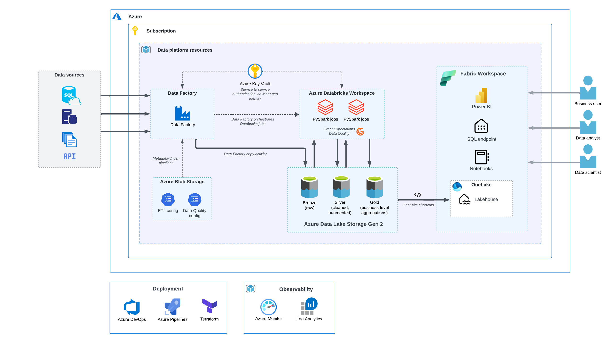

Stacks Azure Data Platform serves two primary functions:

* Deployment of a fully integrated, modern Azure Data Platform.
* A framework for generating new data engineering workloads from configurable templates, and deploying them to the Data Platform.

## Architecture of the deployed solution

## Deployment workflow

The following diagrams depict the steps to create a Stacks Data Platform and data engineering workloads.

### High-level workflow

### Detailed workflow

