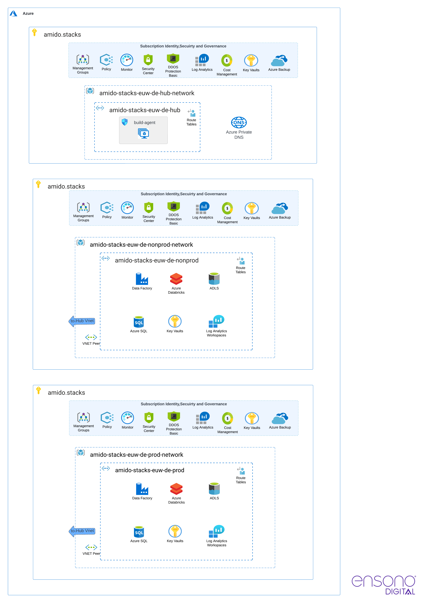

Core data platform resources are defined within Terraform templates and grouped inside
[deploy/azure](https://github.com/ensono/stacks-azure-data/tree/main/deploy/azure) directory.
There are two subfolders in this directory:

* `infra`
* `networking`

## Infrastructure

The `infra` subfolder contains the following definitions:

1. **Resource Group**
2. **Azure SQL Database** sample instance with database schemas
3. **Key Vault**
4. **Key Vault Secrets**:
    * Connection strings for the created SQL databases
    * Passwords to the SQL Databases
    * Service Principal Secret
    * Azure Tenant ID – Directory ID for Azure Active Directory application
    * Azure Client ID – Application ID for Azure Active Directory application
    * Databricks access token & host
    * Other secret names with empty values to be replaced manually. Existing secrets are not
    overwritten.
5. **Azure Data Lake Storage Gen2**
6. **Azure Blob Storage**
7. **Databricks Workspace** including:
    * **Key Vault-backed secret scope**
8. **Azure Data Factory** including:
    * **Managed identity** for the service instance;
    * **Managed virtual network** enabled by default. Creating an integration runtime within
    a managed virtual network ensures the data integration process is isolated and secure.
9. **Managed private endpoints** created in the Data Factory managed virtual network, these
   establish private links to Azure resources, such as:
    * Blob Storage
    * Azure Data Lake Storage
    * Key Vault
    * SQL Database
    * Databricks Workspace
    * Databricks Browser Authentication Page
10. **Role assignments** that assign ADF managed identity roles to access the resources linked by
   the private endpoints.
11. **Log Analytics Workspace**

## Networking

Using a private network is the default behaviour in the Ensono Stacks Data Azure Platform. The `networking`
subfolder contains configurations for the created network and subnetworks, at its core using
[azurerm-hub-spoke](https://github.com/ensono/stacks-terraform/tree/master/azurerm/modules/azurerm-hub-spoke)
Ensono Stacks Terraform module. See [Microsoft documentation](https://learn.microsoft.com/en-us/azure/architecture/reference-architectures/hybrid-networking/hub-spoke?tabs=cli) for more details on implementing Hub-spoke network topology in Azure.

The following diagram shows network configuration for the two default environments:

* Hub network (`is_hub: true`)
* Nonprod (`is_hub: false`)
* Prod (`is_hub: false`)

### Databricks secure cluster connectivity

Ensono Stacks Azure Data Platform uses VNet injection to deploy Databricks into a custom virtual network.

In most scenarios, we recommend that Azure Databricks is deployed in a fully secure manner, using
secure cluster connectivity and disabling public workspace access. This means that Databricks
can only be accessed over a private endpoint from within the private network. This also means that
projects would need to have networking prerequisites such as ExpressRoute or VPNs in order to access
the workspace. If this is not possible, then a virtual machine will need to be set up within the
transit subnet. Users will then need to RDP into the VM and access the workspace via that.

Even without public IPs and with the data plane deployed into our VNet, there is still the option
to toggle access to the Workspace UI via public networks. The default configuration disallows access
to the Databricks workspace over the public internet in production environments, while leaving it
open in development environments. This approach enhances the developer experience in case there is
no properly configured networking/VPN set up in the target subscription.

Enabling public workspace access only opens access to the UI via public internet. Access is still
restricted based on the IAM policy.

The following diagram depicts the Databricks network configuration.

