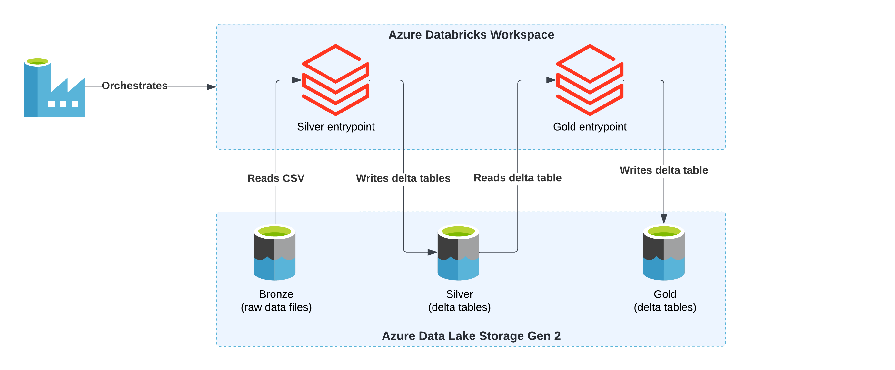
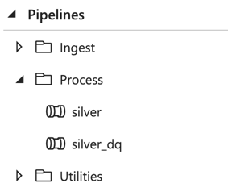
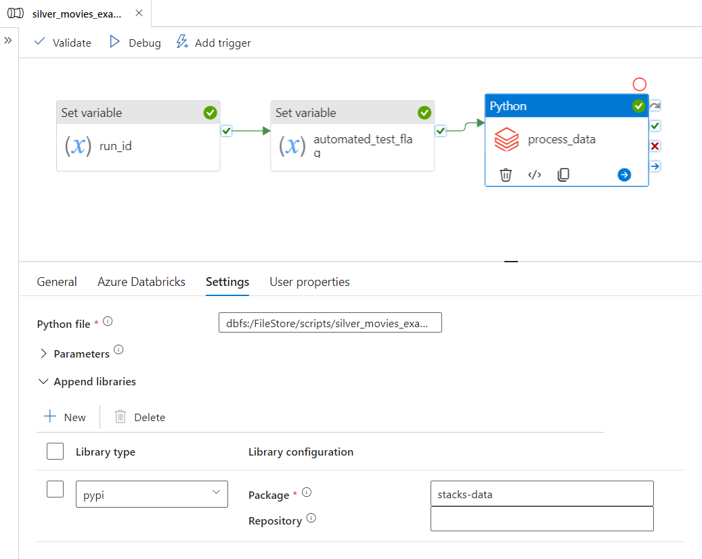
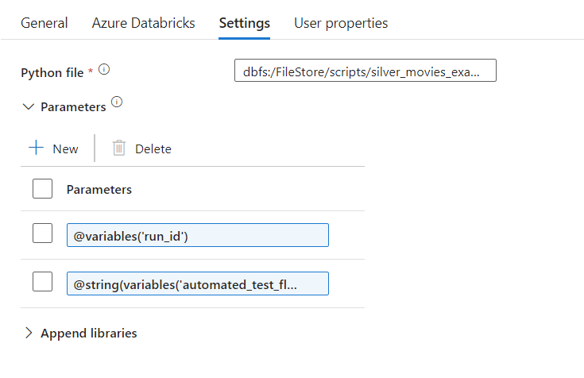

Data processing workloads in Ensono Stacks are jobs which:

1. Take data in the data lake as input (this can be various formats e.g. CSV, Parquet, JSON, Delta).
2. Perform some form of data transformation / cleansing / modelling / aggregation over the data.
3. Output the into the data lake into a structured [Delta Lake](https://delta.io/) format.

Data processing workloads are based upon running Apache Spark / Python jobs on Databricks. These workloads may be used for various levels of data transformation and preparation within the data lake. Within the [medallion architecture](./data_engineering_intro_azure.md#medallion-architecture) these will include:

- Bronze to Silver
- Silver to Gold

Processing workloads will utilise the [Stacks Data Python library](./stacks_data_utilities.md) to support and standardise common tasks. Similar to ingest workloads, data processing workloads can also optionally include a [data quality validations](./data_quality_azure.md) step.

The following example data processing workloads are included for reference:

- [silver_movies_example](https://github.com/Ensono/stacks-azure-data/tree/main/de_workloads/data_processing/silver_movies_example): Performs Bronze to Silver layer data processing over the [example dataset](../getting_started/example_data_source.md).
- [gold_movies_example](https://github.com/Ensono/stacks-azure-data/tree/main/de_workloads/data_processing/gold_movies_example): Aggregates and joins data from the Silver layer example above to create a Gold layer dataset.

## Data processing pipeline overview

Within Stacks, processing activities are performed using Python PySpark jobs. These jobs are orchestrated by pipelines in Data Factory, and executed in Databricks. Using PySpark jobs - as opposed to notebooks - gives full control over the processing activities (for example ensuring thorough [test coverage](./testing_data_azure.md) and quality control).

The diagram below gives an example of a data processing data pipeline in Data Factory.



The Python PySpark script executed is defined in `spark_jobs/process.py` within the workload's directory. This job will utilise the [Stacks Data library](./stacks_data_utilities.md), which provides a wealth of reusable utilities to assist with data transformations and loading data from/into to the data lake. The script gets uploaded to DBFS (`dbfs:/FileStore/scripts/pipeline_name/process.py`) as part of the deployment pipeline, so it is accessible to Databricks.

### Data Factory pipeline design

Within Data Factory, the processing pipelines are kept within the `Process` folder:



An example pipeline is shown below:



The pipeline contains a Python Databricks activity which runs the `process.py` file. The [stacks-data library](./stacks_data_utilities.md) is installed on the cluster via PyPi.

:::tip

It is recommended that specific versions of packages are defined in the Databricks Library configuration (e.g. `stacks-data==0.1.2`) to ensure a reproducible environment for running jobs. This is the default approach when generating workloads using [Datastacks CLI](./datastacks.md). If the version is omitted (e.g. `stacks-data`), then Databricks will use the latest available version - however this is not recommended.

:::

### Passing parameters from Data Factory

You may pass parameters from Data Factory to the Python job executed in Databricks. These are defined in the Settings section of the Databricks Python activity:



These parameters can then be accessed from the Python file, by using the `get_data_factory_param` function - for example the below could be used to access the first parameter shown above:

```python
from stacks.data.pyspark.etl import get_data_factory_param

run_id = get_data_factory_param(1, "default_run_id")
```
