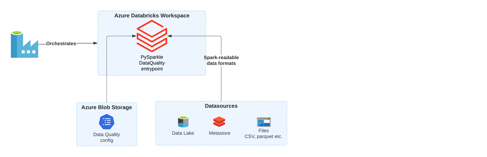
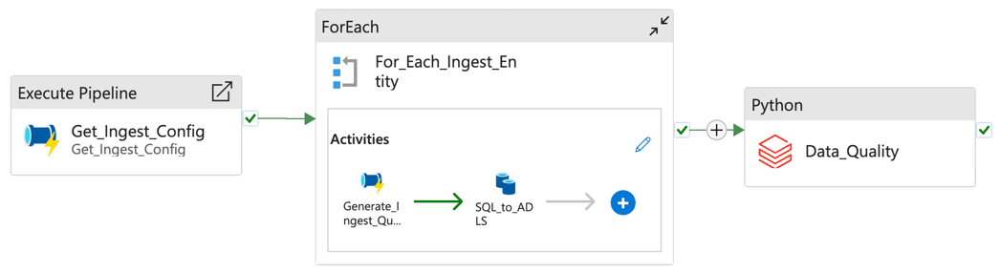

Ensono Stacks data workloads can be deployed with additional data quality checks. These checks validate that the outputs of
a data pipeline meet specified requirements, expressed in a simple, human-readable language. It allows
you to assert expectations about your data, which can help catch any discrepancies, anomalies, or
errors in your data as early in the pipeline as possible.

Data quality checks are executed as Python Databricks jobs with the quality validation logic
packaged within the [Stacks Data library](./stacks_data_utilities.md).
Internally, this leverages the capabilities of the [Great Expectations](https://greatexpectations.io/)
library, an open-source Python library, to perform these checks.

The design of the data quality processing is outlined in the following diagram.




## Data pipelines with quality checks

Both [data ingest](./ingest_data_azure.md) and [data processing](./data_processing.md) pipelines may be generated with a data quality step - see [generating data workloads](./datastacks.md#generating-data-workloads) for details.

The generated workloads will contain a Python script within `spark_jobs/data_quality.py`. This script will be executed via a Databricks Python activity in Data Factory. The script gets uploaded to DBFS (`dbfs:/FileStore/scripts/pipeline_name/data_quality.py`) as part of the deployment pipeline, so it is accessible to Databricks.

### Ingest pipeline example



### Processing pipeline example


## Interactive usage

You can use the [Datastacks CLI](./datastacks.md) to perform data quality checks against a workload interactively. Note, this requires that the [Azure environment variables](./stacks_data_utilities.md#azure-environment-variables) are set:

```bash
datastacks dq --help

# Execute data quality checks using the provided config
datastacks dq --config-path "ingest/ingest_azure_sql_example/data_quality/ingest_dq.json" --container config
```

`config-path` is a path to a JSON config inside the Azure Blob container, `container` is name of the container. The storage account used will be based upon the `CONFIG_BLOB_ACCOUNT` environment variable.

## JSON Configuration File for Great Expectations

This section describes the structure of the JSON configuration file used for the data quality process.
The configuration is defined using Python's Pydantic library for data validation.

1. `gx_directory_path`: Path to the Great Expectations metadata store.
2. `dataset_name`: Name of the dataset that is being processed.
3. `dq_input_path`: Path to where the input data is stored. For data stored in files, this would be a URI, e.g. `"abfss://raw@accountname.dfs.core.windows.net/ingest_azure_sql_example/"`
4. `dq_output_path`: Path to where data quality results will be written.
5. `datasource_config`: Configuration for the dataset being tested.
    1. `datasource_name`: Name of the data asset, e.g. table or file name.
    2. `datasource_type`: Data type of the asset - this can be any type that Spark can read from, e.g. table, parquet, csv, delta.
    3. `data_location`: Location of the given data asset.
       * If the data is stored in files, like a Parquet file on ADLS, you should
       provide the complete path to the file within the `dq_input_path`. Examples:
          * `"myfolder/mysubfolder/myfile.parquet"`
          * `"myfolder/mysubfolder/*"`
       * For tables with metadata managed by a data catalog, you should provide
       the database schema and the table name. Example:
          * `staging.table_name`
    4. `expectation_suite_name`: Name of the expectation suite associated with this data source.
    5. `validation_config`: A list of validation configurations where each configuration contains the following fields:
        1. `column_name`: Name of the validated column.
        2. `expectations`: List of expectations where each expectation has the following fields:
            * `expectation_type`: Name of the Great Expectations [expectation class](https://greatexpectations.io/expectations/) to use.
            * `expectation_kwargs`: The keyword arguments to pass to the expectation class.

### Using environment variables in configuration files

It is possible to use environment variables in a configuration file for data quality.
Placeholders in the form of `{ENV_VAR_NAME}` will be replaced with the corresponding environment
variable values. For example, you can pass the ADLS name using an environment variable:

```json
{
  "dq_input_path": "abfss://raw@{ADLS_ACCOUNT}.dfs.core.windows.net/ingest_azure_sql_example/"
}
```

### Example

Here's a minimal example of a configuration file:

```json
{
    "gx_directory_path": "/dbfs/great_expectations/",
    "dataset_name": "movies",
    "dq_input_path": "abfss://raw@{ADLS_ACCOUNT}.dfs.core.windows.net/ingest_azure_sql_example/",
    "dq_output_path": "abfss://raw@{ADLS_ACCOUNT}.dfs.core.windows.net/ingest_azure_sql_example/",
    "datasource_config": [
        {
            "datasource_name": "movies.movies_metadata",
            "datasource_type": "parquet",
            "data_location": "movies.movies_metadata/v1/*/*/*",
            "expectation_suite_name": "movies.movies_metadata_suite",
            "validation_config": [
                {
                    "column_name": "status",
                    "expectations": [
                        {
                            "expectation_type": "expect_column_values_to_be_in_set",
                            "expectation_kwargs": {"value_set": ["Canceled", "In Production", "Planned", "Post Production", "Released", "Rumored"]}
                        }
                    ]
                }
            ]
        }
    ]
}
```

## Validation results

Results of the data quality checks are stored in the `dq_output_path` location in Delta tables. Their names follow the format `{datasource_name}_dq`, e.g. `movies.movies_metadata_dq`. The results contain the following columns:

| Column Name           | Type    | Description                                                                                       |
|-----------------------|---------|---------------------------------------------------------------------------------------------------|
| data_quality_run_date | date    | Timestamp of the data quality run.                                                                |
| datasource_name       | string  | Name of the data asset.                                                                           |
| column_name           | string  | Name of the column.                                                                               |
| validator             | string  | Name of the validator.                                                                            |
| value_set             | string  | The set of values a column should have (if applicable).                                           |
| threshold             | string  | The percentage of rows that should pass the validation for the check to be considered successful. |
| failure_count         | string  | The number of rows that failed the validation.                                                    |
| failure_percent       | string  | The percentage of rows that failed the validation (expressed as a decimal between 0 and 1).       |
| failure_query         | string  | A query that can be used to retrieve the rows that failed the validation.                         |
| dq_check_exception    | boolean | True if an exception occurred while running the check.                                            |
| exception_message     | string  | The exception message if an exception was raised.                                                 |
| success               | boolean | True if the dataset passed the check.                                                             |
