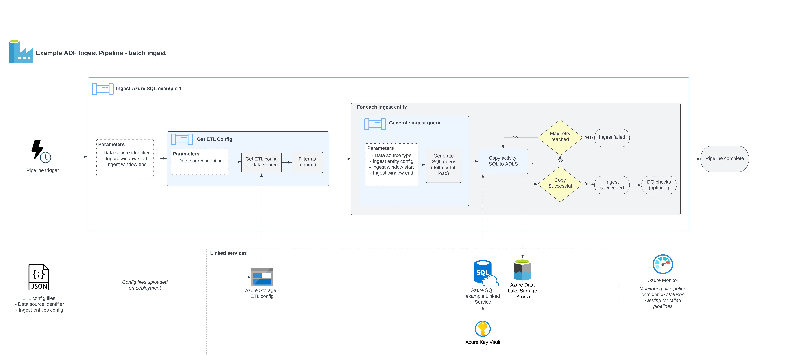
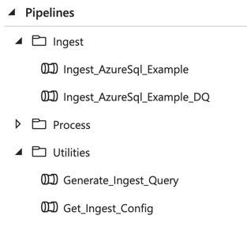

Data ingest workloads in Ensono Stacks are jobs which:

1. Connect to an external data source
2. Land the data in the Bronze (raw) layer of the data lake

Data ingest workloads utilise [Azure Data Factory's inbuilt connectors](https://learn.microsoft.com/en-us/azure/data-factory/connector-overview) and [Copy activity](https://learn.microsoft.com/en-us/azure/data-factory/copy-activity-overview), to give the ability to easily ingest data from a wide range of data sources. The ingest process is designed around reusable, metadata-driven pipelines. This means once
an initial data pipeline is created for a given data source, additional entities from the same data source can be added or modified just by updating a configuration file.

Data ingest workloads may also optionally include a [data quality validations](./data_quality_azure.md) step, executed in Databricks.

The solution contains the following example data ingest workload:

- [ingest_azure_sql_example](https://github.com/ensono/stacks-azure-data/tree/main/de_workloads/ingest/ingest_azure_sql_example): Ingests data from the [example Azure SQL source](../getting_started/example_data_source.md) and lands data into the data lake Bronze layer.

## Data source types

The example ingest pipeline is based around an Azure SQL data source. Further data source types will continue to be added as templates in [Datastacks](./datastacks.md) in future. If the data source type you require is not yet available, the existing templates are adaptable for most other data source types with minimal modifications.

The following files within the workload would need to be updated to modify an ingest workload to be based around a different data source type:

- `data_factory/adf_linked_services` - The Linked Service establishes the connection to the data source. The linked service `type` property must be specific to the data source type.
- `data_factory/adf_datasets` - The Dataset needs to define the data that will be retrieved from the Linked Service. It should be parameterised wherever possible.
- `data_factory/pipelines/ARM_IngestTemplate.json` - The Copy Activity in the pipeline may need modifying to reflect the new Dataset type.

See [Data Factory development quickstart](../getting_started/dev_quickstart_data_azure.md#azure-data-factory-development) for further information on updating Data Factory resources.

:::note Updating Data Factory resources

The structure of the data platform and Data Factory resources are defined in the project's code repository, and deployed through the Azure DevOps pipelines. Changes to Data Factory resources directly through the UI will lead to them being overwritten when deployment pipelines are next run.

:::

## Pipeline overview

The diagram below gives an overview of the ingestion pipeline design.



## Configuration

The configuration files for the workload are
stored in the pipeline's [config](https://github.com/ensono/stacks-azure-data/tree/main/de_workloads/ingest/Ingest_AzureSql_Example/config) directory.

JSON format is used for the configuration files. Our blueprint includes a sample configuration definition for the data ingestion sources, e.g.
([ingest_config.json](https://github.com/ensono/stacks-azure-data/blob/main/de_workloads/ingest/ingest_azure_sql_example/config/ingest_sources/ingest_config.json))
and its schema ([ingest_config_schema.json](https://github.com/ensono/stacks-azure-data/blob/main/de_workloads/ingest/ingest_azure_sql_example/config/schema/ingest_config_schema.json)).


See the descriptions of the example JSON config file below:

```bash
{
    "data_source_name": "example_azuresql_1",  # Identifier of the data source - must be unique
    "data_source_type": "azure_sql",           # Data source type
    "enabled": true,                           # Boolean flag to enable / disable the data source from being ingested
    "ingest_entities": [                       # Array of entities to be ingested from the source
        {
            "version": 1,                      # Version number - increment this if the entity's schema changes
            "display_name": "SalesLT.Product", # Name to identify the entity - must be unique per data source
            "enabled": true,                   # Boolean flag to enable / disable the entity from being ingested
            "schema": "SalesLT",               # (SQL sources only) Database schema
            "table": "Product",                # (SQL sources only) Database table
            "columns": "*",                    # (SQL sources only) Columns to select. May also contain SQL-expressions for columns.
            "load_type": "delta",              # (SQL sources only) Full or delta load. If delta load selected, then also include the following keys
            "delta_date_column": "ModifiedDate",  # (SQL sources only, delta load) Date column to use for filtering the date range. May also contain SQL-expressions for columns.
            "delta_upsert_key": "SalesOrderID"    # (SQL sources only, delta load) Primary key for determining updated columns in a delta load. May also contain SQL-expressions for columns.
        }
    ]
}
```

:::tip

The `ingest_config.json` example is based upon an Azure SQL data source. Different data data source types would be expected to have the same JSON keys, except for under `ingest_entities`, where different keys will be required dependent on the data source type.

:::

These configuration files will be referenced each time an ingestion pipeline
is triggered in Data Factory, and all entities will be ingested. To disable a particular ingest
source or entity without removing it, you can set `"enabled": false` – these will be ignored by
the Data Factory pipeline.

[Unit tests](https://github.com/ensono/stacks-azure-data/tree/main/de_workloads/ingest/ingest_azure_sql_example/tests/unit)
are provided to ensure the config files remain valid against the schema.

### Query generation

Values from the config will be used to generate the logic for extracting from the data source. For an Azure SQL data source, an SQL query would be generated for each ingest_entity as follows:

#### Full load

```sql
SELECT {columns}
FROM {schema}.{table}
;
```

#### Delta load

Note: `run_window_start_date` and `run_window_end_date` are determined by the values passed at runtime, e.g. by the [tumbling window trigger](#data-factory-triggers).

```sql
SELECT {columns}
FROM {schema}.{table}
WHERE {delta_date_column} >= {run_window_start_date}
  AND {delta_date_column} < {run_window_end_date}
;
```

## Data Factory pipeline design

The provided sample pipelines give an example of a data ingest process from source to the data lake.
The pipelines folder is structured as follows:



- `Ingest` contains ingest pipelines specific to the given data source. The naming convention for
these pipelines is `Ingest_{SourceType}_{SourceName}`. These are the parent pipelines that would be
triggered on a recurring basis to ingest from a data source. All pipelines have their equivalents
that include data quality validations. Depending on your particular needs, you can deploy each of
the pipelines with or without this additional data quality step. [Further information on data quality](data_quality_azure.md).
- The pipelines within `Utilities` are reusable and referenced by other pipelines. They are not
meant to be triggered independently. These are defined within the [shared_resources](https://github.com/ensono/stacks-azure-data/tree/main/de_workloads/shared_resources) for the project.

The `ingest_azure_sql_example` pipeline consists of the following steps:


1. `Get_Ingest_Config`: Calls the utility pipeline, passing the data source name as a parameter.
This will return the configuration required for the given data source.
2. `For_Each_Ingest_Entity`: Loop through each ingest entity performing the following steps:
    1. `Generate_Ingest_Query`: Generates a SQL query to extract the data from a required time range,
    according to the provided configuration. Depending on the load type, one of the two scenarios
    below will be applied:
       - Full extraction loads all available data for a given set of columns,
       - Delta queries contain a `WHERE` clause to restrict the date range loaded.
    2. `SQL_to_ADLS`: Execute the SQL query against the data source, and copy the results to the
    Azure Data Lake storage landing container under the appropriate path (data is validated using
    ADF's built-in data validation capability).

The following picture shows the two possibilities of full vs delta extraction in `Generate_Ingest_Query`:


### Data Factory triggers

An example Data Factory pipeline trigger is provided and associated to the ingest pipeline. Triggers can be viewed in the Data Factory UI through Manage > Triggers.

The example triggers utilise the [tumbling window trigger](https://learn.microsoft.com/en-us/azure/data-factory/how-to-create-tumbling-window-trigger?tabs=data-factory) type. A tumbling window is a continuous and non-overlapping time interval. It allows reliable incremental data ingestion and, in Data Factory, allows re-running of specific windows later if an error happens and ensures that no data will be lost.

The trigger can be setup to any granularity down to 5 minutes. Every time it triggers a pipeline, it automatically passes the windowStart and windowEnd parameters for the relevant time window.
If any kind of incident happens, the missing or failed time windows will run retroactively as soon as possible, either sequentially or in parallel (following the Max concurrency option). The benefit of this behaviour it that it guaranties that no time windows are lost or forgotten even if ran days later. Data Factory allows us to re-run individual time windows at will, even if they succeeded.

Other types of Data Factory triggers are available, including schedule or event-based - these may be utilised dependent on your requirements.
