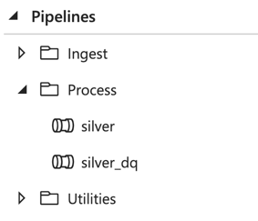
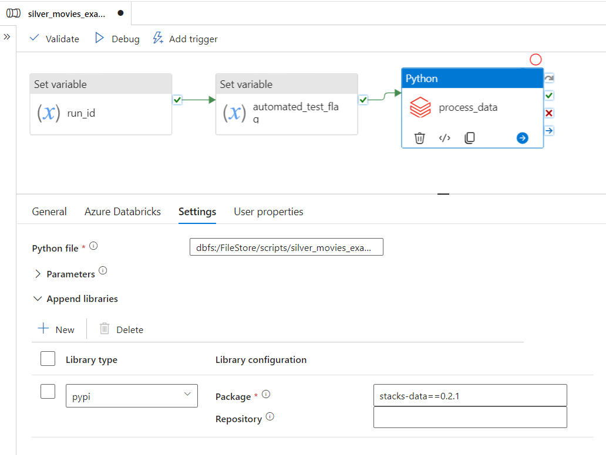

Data processing workloads in Stacks are jobs which:

1. Take data in the data lake as input (this can be various formats e.g. CSV, Parquet, JSON, Delta).
2. Perform some form of data transformation / cleansing / modelling over the data.
3. Output the into the data lake into a structured [Delta Lake](https://delta.io/) format.

While [data ingest workloads](./ingest_data_azure.md) in Stacks utilise Azure Data Factory's inbuilt connectors and Copy activity, data processing workloads are based upon running Apache Spark / Python jobs on Databricks. These workloads may be used for various levels of data transformation and preparation within the data lake. Within the [medallion architecture](./etl_intro_data_azure.md#medallion-architecture) these will include:

- Bronze to Silver
- Silver to Gold

Similar to ingest workloads, data processing workloads can optionally include a [Data Quality validations](./data_quality_azure.md) step. Depending on your requirements, you can generate a workload with or without a Data Quality step.

The Stacks data platform contains the following example data processing workloads:

- [silver_movies_example](https://github.com/Ensono/stacks-azure-data/tree/main/de_workloads/data_processing/silver_movies_example): Performs Bronze to Silver layer data processing over the [example dataset](../getting_started/example_data_source.md).

## Silver processing

The transformation from Bronze to Silver is crucial for filtering out the noise from raw data. It ensures that analysts
and data scientists work with a consistent, clean, and dependable dataset that can be trusted for downstream analytics.

As data moves to the Silver layer, it undergoes a series of transformations:

- **Conformance**: At this stage, inconsistencies in data representation are ironed out. For instance, disparate date
formats, value representations, or units from different data sources are standardized to a common format.
- **Cleansing**: Data errors, missing values, or duplicates, are identified and rectified. This ensures that downstream
analytics are based on clean and reliable data.
- **Enrichment**: Data from various sources might be combined or enriched with additional information to provide a more
holistic dataset.
- **Structuring**: While the Bronze layer often holds semi-structured or unstructured data, the Silver layer typically
structures this data into a more query-friendly format, enabling efficient data analysis.
- **Data Quality Checks**: This stage ensures that the data conforms to predefined quality standards, making sure it's
reliable and accurate.

## Data processing pipeline overview

The diagram below gives an overview of a data processing data pipeline in Data Factory.

The processing is executed as Python Databricks job, with repeatable data transformation processes packaged within
our [PySparkle](pysparkle.md) library.

Transformation and processing logic specific to particular datasets is kept inside the `spark_jobs` directory for the workload.

### Data Factory pipeline design

Data processing pipelines are kept within the `Process` folder in Data Factory:

In Data Factory a standard data processing pipeline is as simple as this:

It contains just one step - Python Databricks, configured to run a `silver.py` script, which gets deployed to DBFS
(`dbfs:/FileStore/scripts/silver/silver.py`). The Datastacks / PySparkle package and library is deployed to DBFS, and made available to the cluster.
