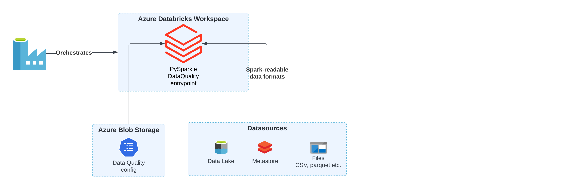
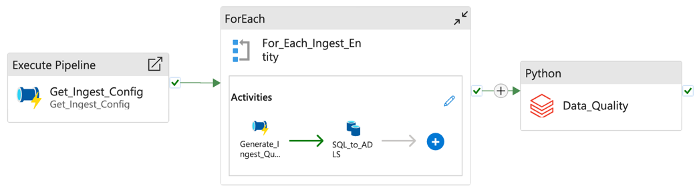

[stacks-azure-data](https://github.com/amido/stacks-azure-data) ETL pipelines in Azure Data Factory
can be deployed with additional Data Quality checks. These checks validate that the outputs of
a pipeline meet specified requirements, expressed in a simple, human-readable language. It allows
you to assert expectations about your data, which can help catch any discrepancies, anomalies, or
errors in your data as early in the pipeline as possible.

Data Quality checks are executed as Python Databricks jobs with the quality validation logic
packaged within our [PySparkle](../../../common/data/pysparkle/pysparkle_data_quality.md) library.
Internally, PySparkle leverages the capabilities of the [Great Expectations](https://greatexpectations.io/)
library, an open-source Python-based library, to perform these checks.

The design of the Data Quality processing is outlined in the following diagram.

## ADF Pipelines with DQ

### Ingest

### Silver

