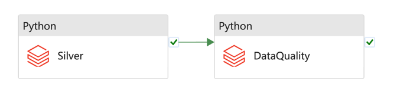

Ensono Stacks data workloads can be deployed with additional Data Quality checks. These checks validate that the outputs of
a data pipeline meet specified requirements, expressed in a simple, human-readable language. It allows
you to assert expectations about your data, which can help catch any discrepancies, anomalies, or
errors in your data as early in the pipeline as possible.

Data Quality checks are executed as Python Databricks jobs with the quality validation logic
packaged within our [PySparkle](pysparkle.md) library.
Internally, PySparkle leverages the capabilities of the [Great Expectations](https://greatexpectations.io/)
library, an open-source Python-based library, to perform these checks.

The design of the Data Quality processing is outlined in the following diagram.


## ADF Pipelines with DQ

### Ingest


### Silver



## Usage

To perform data quality checks against a workload interactively, you can use the [Datastacks](./datastacks.md) CLI. Note, this also requires that the [Pysparkle environment variables](./pysparkle.md#pysparkle-environment-variables) are set:

```bash
datastacks dq --help
datastacks dq --config-path "ingest/Ingest_AzureSql_Example/data_quality/ingest_dq.json" --container config
```

`config-path` is a path to a JSON config inside the Azure Blob container, `container` is name of the container. The storage account used will be based upon the `BLOB_ACCOUNT` environment variable.

## JSON Configuration File for Great Expectations

This section describes the structure of the JSON configuration file used in our system.
The configuration is defined using Python's Pydantic library for data validation.

Here is the description of the main elements:

1. `gx_directory_path`: Path to the Great Expectations metadata store.
2. `dataset_name`: Name of the dataset that is being processed.
3. `datasource_config`: Configuration for the dataset being tested.
    1. `datasource_name`: Name of the data asset, e.g. table or file name.
    2. `datasource_type`: Data type of the asset - this can be any type that Spark can read from, e.g. table, parquet, csv, delta.
    3. `data_location`: Location of the given data asset. It can either be a path to files in the data lake
    or a fully qualified table name, depending on the data source:
       * If the data is stored in a file, like a Parquet file on ADLS, you should
       provide the complete path to the file. Examples:
          * `"abfss://raw@accountname.dfs.core.windows.net/myfolder/mysubfolder/myfile.parquet"`,
          * `"abfss://raw@accountname.dfs.core.windows.net/myfolder/mysubfolder/*"`,
          * `"abfss://staging@{ADLS_ACCOUNT}.dfs.core.windows.net/myfolder/mysubfolder/*"`.
       * For tables with metadata managed by a data catalog, you should provide
       the database schema and the table name. For example, `staging.table_name`.
    4. `expectation_suite_name`: Name of the expectation suite associated with this data source.
    5. `validation_config`: A list of validation configurations where each configuration contains the following fields:
        1. `column_name`: Name of the validated column.
        2. `expectations`: List of expectations where each expectation has the following fields:
            * `expectation_type`: Name of the Great Expectations [expectation class](https://greatexpectations.io/expectations/) to use.
            * `expectation_kwargs`: The keyword arguments to pass to the expectation class.

### Example

Here's a minimal example of a configuration file:

```json
{
    "gx_directory_path": "/dbfs/great_expectations/",
    "dataset_name": "movies",
    "dq_output_path": "abfss://raw@{ADLS_ACCOUNT}.dfs.core.windows.net/Ingest_AzureSql_Example/",
    "datasource_config": [
        {
            "datasource_name": "movies.movies_metadata",
            "datasource_type": "parquet",
            "data_location": "abfss://raw@{ADLS_ACCOUNT}.dfs.core.windows.net/Ingest_AzureSql_Example/movies.movies_metadata/v1/*/*/*",
            "expectation_suite_name": "movies.movies_metadata_suite",
            "validation_config": [
                {
                    "column_name": "status",
                    "expectations": [
                        {
                            "expectation_type": "expect_column_values_to_be_in_set",
                            "expectation_kwargs": {"value_set": ["Canceled", "In Production", "Planned", "Post Production", "Released", "Rumored"]}
                        }
                    ]
                }
            ]
        }
    ]
}
```

### Using environment variables in configuration files

It is possible to use environment variables in a configuration file for Data Quality.
Placeholders in the form of `{ENV_VAR_NAME}` will be replaced with the corresponding environment
variable values. For example, you can pass the ADLS name using an environment variable:

```json
{
  "data_location": "abfss://raw@{ADLS_ACCOUNT}.dfs.core.windows.net/example_azuresql_1/SalesLT.Product/v1/*/*/*"
}
```
