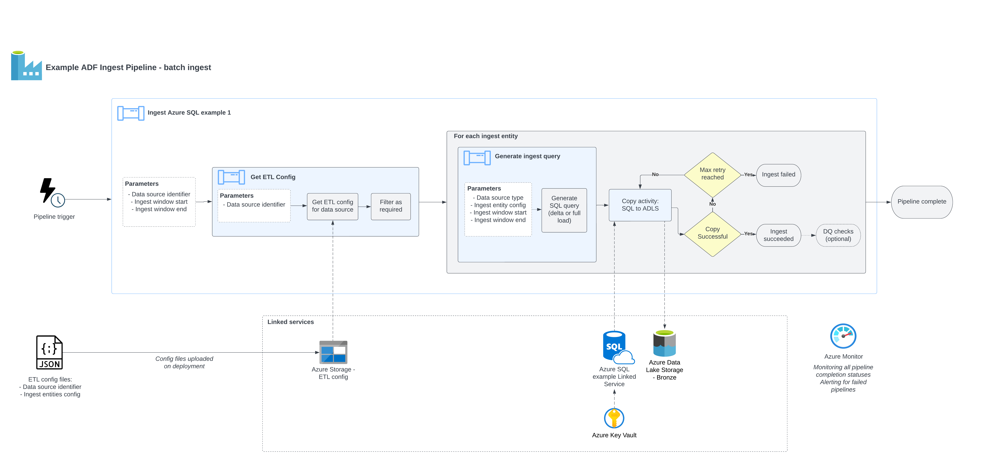
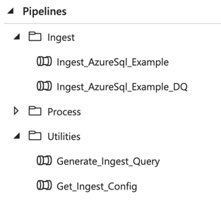
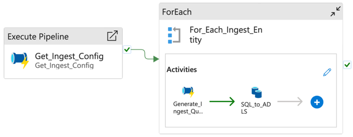
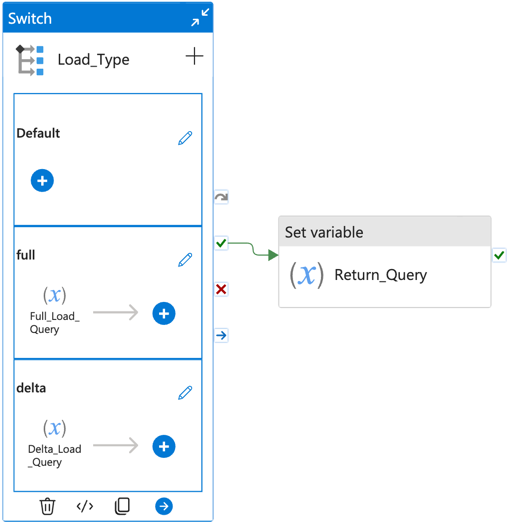

The solution contains a sample Azure Data Factory pipeline for ingesting data from a sample data
source (Azure SQL) and loading data into the data lake 'landing' zone.

Link to the pipeline: [stacks-azure-data/de_workloads/ingest](https://github.com/amido/stacks-azure-data/tree/main/de_workloads/ingest/Ingest_AzureSql_Example).

## Pipeline overview

The diagram below gives an overview of the ingestion pipeline design.



## Configuration

The ingest process is designed around reusable, metadata-driven pipelines. This means once
an initial data pipeline is created for a given data source, additional entities from the same data
source can be added or modified just by updating a configuration file. These configuration files are
stored in the pipeline's [config](https://github.com/amido/stacks-azure-data/tree/main/de_workloads/ingest/Ingest_AzureSql_Example/config) directory.

JSON format is used for the configuration files. Our blueprint includes a sample configuration definition for the data ingestion sources
([Ingest_AzureSql_Example.json](https://github.com/amido/stacks-azure-data/blob/main/de_workloads/ingest/Ingest_AzureSql_Example/config/ingest_sources/Ingest_AzureSql_Example.json))
and its schema ([ingest_config_schema.json](https://github.com/amido/stacks-azure-data/blob/main/de_workloads/ingest/Ingest_AzureSql_Example/config/schema/ingest_config_schema.json)).

The sample ingest pipeline is based around an Azure SQL data source, however the approach used should be adaptable for most other data source types with minimal modifications. Different data data source types would be expected to have the same JSON keys, except for under `ingest_entities`,
where different keys will be required dependent on the data source type.

[Unit tests](https://github.com/amido/stacks-azure-data/tree/main/de_workloads/ingest/Ingest_AzureSql_Example/tests/unit)
are provided to ensure the config files remain valid against the schema. See the descriptions of the
example JSON config file below:

```bash
{
    "data_source_name": "example_azuresql_1",  # Identifier of the data source - must be unique
    "data_source_type": "azure_sql",           # Data source type
    "enabled": true,                           # Boolean flag to enable / disable the data source from being ingested
    "ingest_entities": [                       # Array of entities to be ingested from the source
        {
            "version": 1,                      # Version number - increment this if the entity's schema changes
            "display_name": "SalesLT.Product", # Name to identify the entity - must be unique per data source
            "enabled": true,                   # Boolean flag to enable / disable the entity from being ingested
            "schema": "SalesLT",               # (SQL sources only) Database schema
            "table": "Product",                # (SQL sources only) Database table
            "columns": "*",                    # (SQL sources only) Columns to select
            "load_type": "delta",              # (SQL sources only) Full or delta load. If delta load selected, then also include the following keys
            "delta_date_column": "ModifiedDate",  # (SQL sources only, delta load) Date column to use for filtering the date range
            "delta_upsert_key": "SalesOrderID"    # (SQL sources only, delta load) Primary key for determining updated columns in a delta load
        }
    ]
}
```

These configuration files will be referenced each time an ingestion pipeline
is triggered in Data Factory, and all entities will be ingested. To disable a particular ingest
source or entity without removing it, you can set `"enabled": false` – these will be ignored by
the Data Factory pipeline.

### Data Factory pipeline design

The provided sample pipelines give an example of a data ingest process from source to the data lake.
The pipelines folder is structured as follows:



* `Ingest` contains ingest pipelines specific to the given data source. The naming convention for
these pipelines is `Ingest_{SourceType}_{SourceName}`. These are the parent pipelines that would be
triggered on a recurring basis to ingest from a data source. All pipelines have their equivalents
that include Data Quality validations. Depending on your particular needs, you can deploy each of
the pipelines with or without this additional Data Quality step. [Further information on Data Quality](data_quality_azure.md).
* The pipelines within `Utilities` are reusable and referenced by other pipelines. They are not
meant to be triggered independently. These are defined within the [shared_resources](https://github.com/amido/stacks-azure-data/tree/main/de_workloads/shared_resources) for the project.

The `Ingest_AzureSql_Example` pipeline consists of the following steps:



1. `Get_Ingest_Config`: Calls the utility pipeline, passing the data source name as a parameter.
This will return the configuration required for the given data source.
2. `For_Each_Ingest_Entity`: Loop through each ingest entity performing the following steps:
    1. `Generate_Ingest_Query`: Generates a SQL query to extract the data from a required time range,
    according to the provided configuration. Depending on the load type, one of the two scenarios
    below will be applied:
       * Full extraction loads all available data for a given set of columns,
       * Delta queries contain a `WHERE` clause to restrict the date range loaded.
    2. `SQL_to_ADLS`: Execute the SQL query against the data source, and copy the results to the
    Azure Data Lake storage landing container under the appropriate path (data is validated using
    ADF's built-in data validation capability).

The following picture shows the two possibilities of full vs delta extraction in `Generate_Ingest_Query`:


