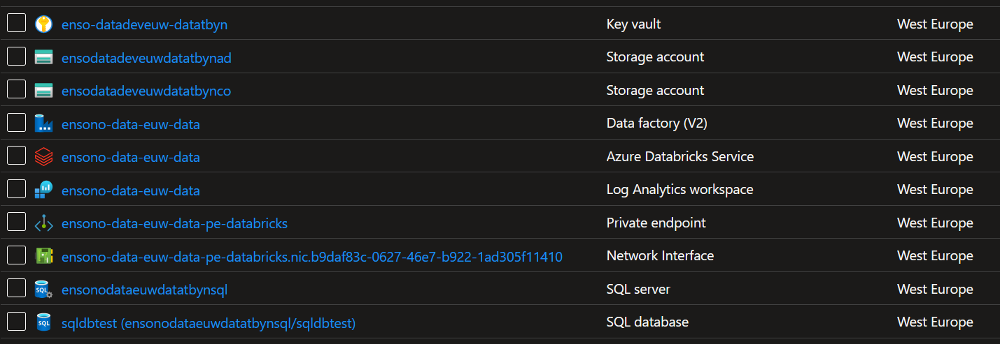

This section provides an overview of configuring and deploying the core data platform infrastructure in Azure.

It assumes you have [generated a new data project using Ensono Stacks](./generate_project.md), and that the following [requirements](./requirements_data_azure.md) are in place:

* [Azure subscription and service principal](./requirements_data_azure.md#azure-subscription)
    * If you want to provision the infrastructure within a private network, this can be done as part of a [Hub-Spoke network topology](../architecture/infrastructure_data_azure#networking). Spoke virtual network and subnet for private endpoints must be provisioned for each environment. The hub network must contain a self-hosted agent. See [Microsoft documentation](https://learn.microsoft.com/en-us/azure/architecture/reference-architectures/hybrid-networking/hub-spoke?tabs=cli) for more details on implementing Hub-spoke network topology in Azure.

## Step 1: Add Infrastructure pipeline in Azure DevOps

A YAML file containing a template Azure DevOps CI/CD pipeline for building and deploying the core infrastructure is provided in `build/azdo/azure/pipeline-infra-private.yml` - this should be added as the definition for a new pipeline in Azure DevOps.

1. Sign-in to your Azure DevOps organization and go to your project
2. Go to Pipelines, and then select **New pipeline**
3. Name the new pipeline, e.g. `ensono.stacks-data-infrastructure`
4. For the pipeline definition, specify the YAML file in the repository (`pipeline-infra-private.yml`) and save
5. The new pipeline will require access to any Azure DevOps pipeline variable groups specified in the pipeline YAML. Under each variable group, go to 'Pipeline permissions' and add the pipeline.

## Step 2: Deploy Infrastructure in non-production environment

Run the pipeline configured in Step 1 to commence the build and deployment process.

When running this pipeline, a number of parameters are available. The two that affect which env is deployed are:

- Environment Name
  - Can be one of `dev`, `qa`, `uat`, `prod`
- Environment Group
  - Can be one of `nonprod`, `prod`. This changes which variable group is used to provide authentication details for the subscription.

Thus the pipeline must be run for each of the environments that need to be deployed. The parameters available for the pipeline run are as follows:

| Name | Description | Default |
|------|-------------|---------|
| Destory Enviornment | State if the environment should be destroyed | `false` |
| Deploy Environment | State if the environment should be deployed | `true` |
| Environment Group | The name of the envronment group being deployed to. This controils which credentials variable group is used. | `nonprod` |
| Environment Name | The name of the environment that is being deployed | `dev` |
| Networking Pipeline Definition ID | The networking pipeline produced artifacts that this pipeline requires. The ID of that pipeline is requirted for this pipeline to download thos artifacts | 

<figure>

<figcaption>Azure DevOps Infra Pipeline Parameters</figcaption>
</figure>

If successful, the core infrastructure resources will now be available in the nonprod Ensono Stacks environment. To view these deployed resources, navigate to the [Azure portal](https://portal.azure.com/) and search for the resource group associated with the deployment. This resource group is named based upon values provided during step 1 in the pattern
`<companyname>-<projectname>-<region>-<environment>-<component>` (for example: `ensono-data-euw-data-dev`). Within the resource group, you'll find a list of the resources that were deployed.

<figure>

<figcaption>Azure Infra Resource Groups</figcaption>
</figure>

:::note
The resource group `databricks-rg-ensono-data-euw-data-dev` is an automatic resource group that contains the databricks deployment. This does not need to be accesed or managed.
:::

<figure>

<figcaption>Azure Resources for Dev Infrastructure</figcaption>
</figure>

Once the resources have been deployed a new variable group will have been created in Azure DevOps for the specified environment. In this example, and for the `dev` enviornment, the variable group will be called `ensono-data-data-dev-infra`.

## Step 3: Deploy Infrastructure in further environments

By default Ensono Stacks provides a framework for managing the platform across 4 environments - dev, qa, uat, prod in 2 envrionment groups nonprod, prod.
The template CI/CD pipelines provided are based upon these names - but these may be amended depending upon the specific requirements of your project and organisation.

* Deployment to the non-production (nonprod) environment is triggered on a feature branch when a pull request is open
* Deployment to the production (prod) environment is triggered on merging to the `main` branch, followed by manual approval of the release step.

## Next steps

Now you have generated and deployed a new Ensono Stacks Data Platform, [create Databricks token](./databricks_config.mdx).
