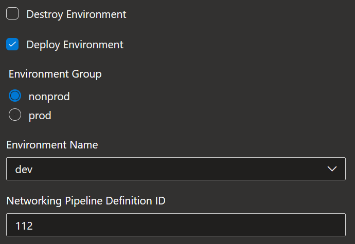
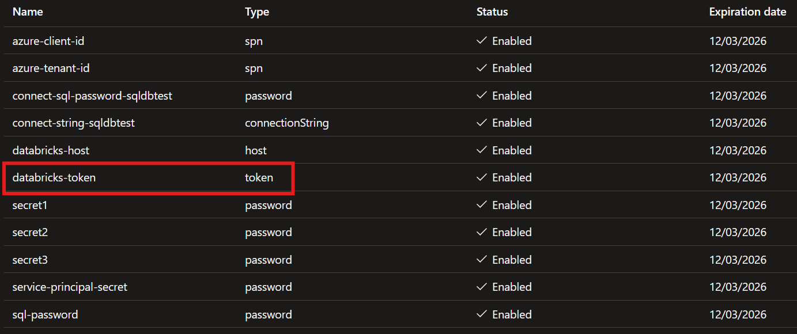

import TerraformDeployTasks from "../snippets/_terraform_plan_deploy_tasks.mdx"
import TerraformDeployPipeline from "../snippets/_terraform_plan_deploy_pipeline.mdx"

This section provides details on how to run the last stage of the deployment. This creates the Databricks token and adds it to the key vault. This is a seperate stage because of the way in which the resources are deployed and the token cannot be created at the same time as the Databricks resource is.

## Workstation Deployment

### Step 1: Source Environment Files

As before, the environment files for the base configuration have been created already. The one pertaining to the databricks configuration needs to be sourced. In addition the networking setup created more environment files that are based on the outputs of the Terraform. This means that the settings for the next stage are easily referenced.

import SourceInfraEnvsPowershell from "../snippets/powershell/_source_envfile_infra.mdx"
import SourceInfraEnvsBash from "../snippets/bash/_source_envfile_infra.mdx"

| Shell | Command |
|---|---|
| </img> | <SourceInfraEnvsPowershell /> |
| </img> | <SourceInfraEnvsBash /> |

The first file, `envfile_databricks.bash` configures the necessary variables which state the files that should be deployed (via the STAGE variable) as well as sourcing the credentials file again. This is done in case a different shell has been started after deployment.

The second file, `dev-infra-envvars.bash` contains the outputs from the infrastructure stage which relate to the variables required for the inputs of the data infrastructure.

### Step 2: Deploy the Databricks configuration

Now that everything is setup the data platform infrastructure can be deployed. As before the `STAGE` being run can be confirmed by reading the environment variable in the session, after sourcing the environment variables.

| Shell | Command |
|---|---|
| </img> | `$env:STAGE` |
| </img> | `echo $STAGE` |

</img>
<figcaption>Check the environment variables</figcaption>

After the local environment has been configured, run the following commands.

| Shell | Command |
|---|---|
| </img>   </img> | <TerraformDeployTasks /> |

Alternatively the EIR pipeline run be run which will bundle all of the above tasks together.

| Shell | Command |
|---|---|
| </img>   </img> | <TerraformDeployPipeline /> |

## Azure Devops Pipeline

### Step 1: Add Infrastructure pipeline in Azure DevOps

A YAML file containing a template Azure DevOps CI/CD pipeline for building and deploying the core infrastructure is provided in `build/azdo/azure/pipeline-infra-private.yml` - this should be added as the definition for a new pipeline in Azure DevOps.

1. Sign-in to your Azure DevOps organization and go to your project
2. Go to Pipelines, and then select **New pipeline**
3. Name the new pipeline, e.g. `ensono.stacks-data-databricks`
4. For the pipeline definition, specify the YAML file in the repository (`pipeline-databricks.yml`) and save
5. The new pipeline will require access to any Azure DevOps pipeline variable groups specified in the pipeline YAML. Under each variable group, go to 'Pipeline permissions' and add the pipeline.

## Step 2: Deploy Databricks Configuration

Run the pipeline configured in Step 1 to commence the build and deployment process.

When running this pipeline, a number of parameters are available. The two that affect which env is deployed are:

- Environment Name
  - Can be one of `dev`, `qa`, `uat`, `prod`
- Environment Group
  - Can be one of `nonprod`, `prod`. This changes which variable group is used to provide authentication details for the subscription.

Thus the pipeline must be run for each of the environments that need to be deployed. The parameters available for the pipeline run are as follows:

| Name | Description | Default |
|------|-------------|---------|
| Destory Enviornment | State if the environment should be destroyed | `false` |
| Deploy Environment | State if the environment should be deployed | `true` |
| Environment Group | The name of the envronment group being deployed to. This controils which credentials variable group is used. | `nonprod` |
| Environment Name | The name of the environment that is being deployed | `dev` |
| Networking Pipeline Definition ID | The networking pipeline produced artifacts that this pipeline requires. The ID of that pipeline is requirted for this pipeline to download thos artifacts | 

<figure>

<figcaption>Azure DevOps Infra Pipeline Parameters</figcaption>
</figure>

This deployment does not create any new resource, it configures the Databricks token and adds it to the Key Vault for that environment.

<figure>

<figcaption>Databricks token in Dev Azure Key Vault</figcaption>
</figure>

## Next Steps

Now you have generated and deployed a new Ensono Stacks Data Platform, [setup your local development environment](./dev_quickstart_data_azure.md).