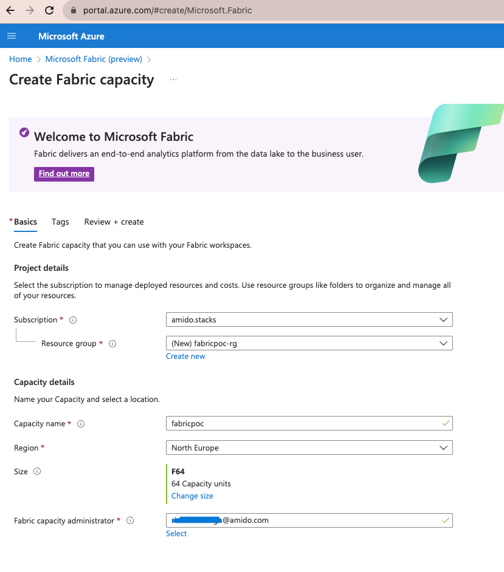
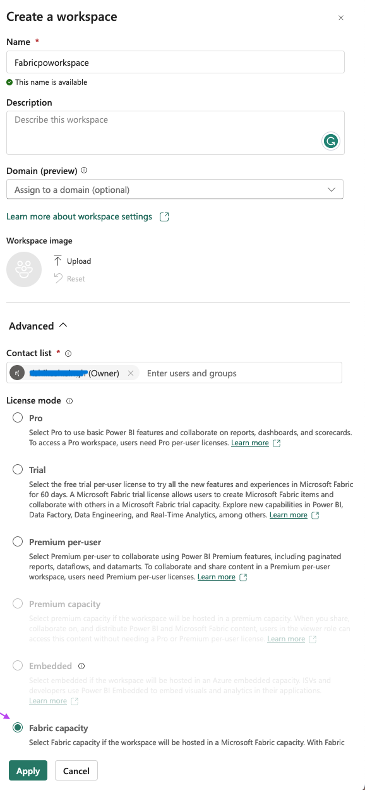
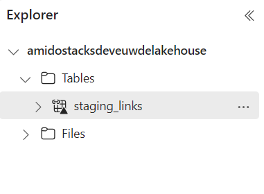

[Microsoft Fabric](https://learn.microsoft.com/en-us/fabric/) can be used to implement a [lakehouse](../data_engineering/data_engineering_intro_azure.md#lakehouse-approach) layer over an Ensono Stacks Data Platform, giving full analytics capabilities over the data lake, and native integrations with tools such as Power BI.

This section provides step-by-step instructions on deploying a Fabric workspace, and setting up a lakehouse over your data lake. It assumes you have deployed an Ensono Stacks Data Platform, and have loaded data into the [bronze layer](./ingest_pipeline_deployment_azure.md) and [silver / gold layers](./processing_pipeline_deployment_azure.md) of the data lake.

:::note Fabric networking

At the time of writing, some networking capabilities are not currently supported in Fabric - for example connecting to data lake storage behind a firewall or virtual network (which is the recommended approach in Ensono Stacks). Once additional key features such as this become available, this documentation will be updated and closer integrations with Ensono Stacks can be implemented.

Please refer to [Microsoft documentation](https://learn.microsoft.com/en-us/fabric/) for the latest updates on Fabric and full documentation.

:::

## Step 1: Create Fabric capacity resource

The first step in setting up a Fabric Workspace is provisioning a capacity resource. Before proceeding, please refer to the official documentation for further details on [capacity licences](https://learn.microsoft.com/en-us/fabric/enterprise/licenses#capacity-license).

To setup a capacity resource in the Azure portal:

1. Login to Azure portal, search for __Microsft Fabric__ and select __Create__.
2. Create a Fabric capacity:
   1. Select the subscription and resource group for the Fabric capacity.
   1. Enter a name to identify the capacity resource (this is displayed in the Microsoft Fabric admin portal and Azure portal). The name must be unique in the selected location.
   1. Select a resource size, based upon your requirements.
   1. Enter a Fabric capacity administrator. The capacity administrator must be a member user or a service principal in your AAD tenant.



## Step 2: Create a Microsoft Fabric Workspace

Workspaces are places to collaborate with colleagues to create collections of items such as lakehouses, warehouses, and reports. please refer below Microsoft link for details on [Fabric workspaces](https://learn.microsoft.com/en-us/fabric/get-started/workspaces). You may create a workspace per environment, to align to your data platform. To setup a Fabric workspace:

1. Go to [https://app.fabric.microsoft.com](https://app.fabric.microsoft.com) and sign-in to your organization's portal. You will need a Power BI Pro license and workspace admin rights on your account to create workspaces.
2. Select the __Data Engineering__ 'experience' from the left plane. Select __Workspaces__ from the left pane, then the __New Workspace__ button.
3. Enter the name of workspace as per your naming conventions (e.g. `ensono-stacks-dev-euw-fabric`). Under advanced options choose __Fabric capacity__ for license mode.
4. Choose the Azure Fabric capacity resource created in Step 1 and select __Apply__.



## Step 3: Create a Lakehouse

We will be creating a [Fabric Lakehouse](https://learn.microsoft.com/en-us/fabric/data-engineering/lakehouse-overview) to access the data in our data lake. To create the lakehouse:

- Within the newly created workspace, select __New Lakehouse__ and enter a name for the lakehouse.


## Step 4: Create Lakehouse Files shortcut

In our Fabric lakehouse we will be creating both _Files_ and _Tables_ shortcuts to our data lake storage containers:

- _Files_ shortcuts will allow us to access all objects in the data lake (regardless of file type). This allows the data to be accessed through [Fabric notebooks](#notebooks).
- _Tables_ shortcuts can be created over Delta Lake format tables (as we have in the Silver and Gold layers of our data lake). Once added as Tables, we can run [SQL queries](#sql-endpoint) and use the data in [Power BI](#power-bi).

See the [overview of OneLake shortcuts](https://learn.microsoft.com/en-us/fabric/onelake/onelake-shortcuts) for further information on the types of shortcut.

Firstly, we will create [Lakehouse Files shortcuts](https://learn.microsoft.com/en-us/fabric/onelake/create-adls-shortcut) to our data lake storage containers.

:::note Secure data lake access

As mentioned above, it is currently not possible to connect to data lake storage behind a firewall or virtual network (which is the recommended approach in Ensono Stacks). Therefore, you can currently only connect to data lake storage which is accessible from public networks. Once this functionality is available in Fabric, these instructions will be updated.

:::

1. Within the lakehouse, right click on __Files__ in the left side pane and choose __New shortcut__.
2. Under __External sources__ select __Azure Data Lake Storage Gen2__.
3. Provide connection details for your ADLS storage account:
    1. Enter the URL for the ADLS Gen 2 endpoint to connect, e.g. `https://amidostacksdeveuwdeadls.dfs.core.windows.net/raw`.
    1. Under __Connection__ select _Create new connection_.
    1. Set a connection name, e.g. `amidostacksdeveuwadls-raw`
    1. For __Authentication kind__ select the method you will use for authenticating with the storage account, for example SAS token (see documentation on [generating SAS tokens for a storage container](https://learn.microsoft.com/en-us/azure/ai-services/translator/document-translation/how-to-guides/create-sas-tokens?tabs=Containers)).
4. Set the and name for the new shortcut, e.g. `amidostacksdeveuwadls-raw`. If you included the container name in the URL, the __Sub Path__ should already be set (e.g. `/raw`).
5. Select `Create`. The shortcut should now be accessible under the Files directory in the lakehouse explorer panel.
6. Repeat the above steps to create a shortcut for each of the data lake containers, i.e. raw, staging, and curated.


## Step 5: Create Lakehouse Tables shortcuts

Tables shortcuts will allow us to interact with query and interact with data stored in Delta Lake format. At present, external tables must be added as shortcuts individually to be fully accessible from the lakehouse.

Follow these steps for each of the tables in the data lake staging (silver) and curated (gold) layers:

1. Within the lakehouse, right click on __Tables__ in the left side pane and choose __New shortcut__.
2. Under __External sources__ select __Azure Data Lake Storage Gen2__.
3. Provide connection details for your ADLS storage account:
    1. Enter the URL for the ADLS Gen 2 endpoint to connect, e.g. `https://amidostacksdeveuwdeadls.dfs.core.windows.net/staging`.
    1. You may re-use the connection to this container created in the previous step.
4. Set the and name for the new table shortcut, e.g. `staging_movies_links`. In the __Sub Path__ provide the path to the Delta table directory in the container (e.g. `/staging/movies/links`).
5. Select `Create`. The shortcut should now be accessible under the Tables directory in the lakehouse explorer panel.
6. Repeat the above steps to create a table shortcut for each of the tables required in the staging and curated containers.



## Step 6: Interacting with data in the lakehouse

Once shortcuts have been added, data in the Lakehouse can be used within Fabric in a number of ways:

### SQL Endpoint

Tables in the lakehouse can be directly queried via the [SQL endpoint](https://learn.microsoft.com/en-us/fabric/data-engineering/lakehouse-sql-endpoint).

1. Within the lakehouse, select the __Lakehouse__ button from the top right corner, and select __SQL Endpoint__.
2. From here, all tables added as shortcuts will be appear as tables in the SQL Endpoint, within the default schema. You can query the tables using SQL. See documentation on the [SQL query editor](https://learn.microsoft.com/en-us/fabric/data-warehouse/sql-query-editor) for more details.

:::tip

Tables in the Lakehouse are read-only via the SQL endpoint. Views can be created.

:::

### Power BI

Tables and views in the lakehouse integrate seamlessly with Power BI. Direct lake mode provides a default Power BI dataset from Tables in the lakehouse. See further information on [Power BI datasets in Fabric](https://learn.microsoft.com/en-us/fabric/data-warehouse/datasets).

### Notebooks

[Fabric notebooks](https://learn.microsoft.com/en-us/fabric/data-engineering/how-to-use-notebook) offer Apache Spark code development over the Lakehouse. Unlike the SQL endpoint which can only query lakehouse _Tables_, using Fabric notebooks you can also interact with lakehouse _Files_ shortcuts. Within your Fabric notebooks, the path to items in the lakehouse is simply `Files/` or `Tables/`, for example:

```python
# Load data directly from Files
df = spark.read.format("delta").load("Files/amidostacksdeveuwdeadls-staging/movies/movies_metadata_dq")

# Display data
display(df.limit(10))
```
