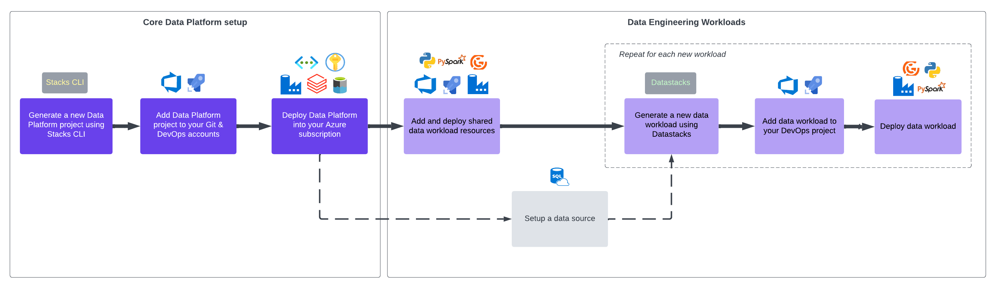

This _Getting Started_ section provides the steps needed to get up and running with Ensono Stacks Data. It follows the [Ensono Stacks Data deployment workflow](../architecture/architecture_data_azure.md).

A more [detailed workflow diagram](../architecture/architecture_data_azure.md#detailed-workflow) is also available.

## Steps

1. [Generate a Data Project](./generate_project.md) - Generate a new data project.
2. [Infrastructure Deployment](./core_data_platform_deployment_azure.md) - Deploy the data platform infrastructure into your cloud environment.
3. [Local Development Quickstart](./dev_quickstart_data_azure.md) - Once your project has been generated, setup your local environment to start developing.
4. [Shared Resources Deployment](./shared_resources_deployment_azure.md) - Deploy common resources to be shared across data pipelines.
5. [Datastacks Build & Deployment](./datastacks_deployment_azure.md) - Build and deploy the Datastacks Python library.
6. (Optional) [Example Data Source](./example_data_source.md) - To assist with the 'Getting Started' steps, you may wish to setup the Example Data Source.
7. [Data Ingest Pipeline Deployment](./ingest_pipeline_deployment_azure.md) - Generate and deploy a data ingest pipeline using the Datastacks CLI.
8. [Data Processing Pipeline Deployment](./processing_pipeline_deployment_azure.md) - Generate and deploy a data processing pipeline using the Datastacks CLI.
