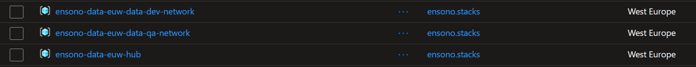

:::note
If you are using an existing hub/spoke network this section can be skipped. However please note that the details of the network and it location will need to be manually set in a variable group.
:::

This section details how to deploy the networking required for the data platform. It assumes that the [a new data project has been generated using Ensono Stacks](./generate_project.md) and that the following [requirements](./requirements_data_azure.md) are in place:

* [Azure subscription and service principal](./requirements_data_azure.md#azure-subscription)
    * If you want to provision the infrastructure within a private network, this can be done as part of a [Hub-Spoke network topology](../architecture/infrastructure_data_azure#networking). Spoke virtual network and subnet for private endpoints must be provisioned for each environment. The hub network must contain a self-hosted agent. See [Microsoft documentation](https://learn.microsoft.com/en-us/azure/architecture/reference-architectures/hybrid-networking/hub-spoke?tabs=cli) for more details on implementing Hub-spoke network topology in Azure.

## Step 1 - Add Netwoking pipeline in Azure DevOps

An Azure DevOps YAML pipeline file is provided in `build/azdo/azure/pipeline-networking.yml` to deploy the networking resources into Azure. This file should be added as the definition for the new file.

1. Sign-in to your Azure DevOps organization and go to your project
2. Go to Pipelines, and then select **New pipeline**
3. Name the new pipeline, e.g. `ensono.stacks-data-networking`
4. For the pipeline definition, specify the YAML file in the repository (`pipeline-networking.yml`) and save
5. The new pipeline will require access to any Azure DevOps pipeline variable groups specified in the pipeline YAML. Under each variable group, go to 'Pipeline permissions' and add the pipeline.

## Step 2 - Deploy networking for environments

As previously mentioned the network is configured as a hub/spoke network, with the central hub in one resource groups and then the spokes in other resource groups based on the environment.

By default the templates understand 4 different environments as defines in the following table.

| Name | Is Prod? | Network Prefix | Comments |
|---|---|---|---|
| hub | | 10.20.0.0./16 | Is environment less, but if deployed across subscriptions there will be two of these hubs |
| dev | false | 10.3.0.0/16 | |
| qa | false | 10.4.0.0/16 | |
| uat | true | 10.5.0.0/16 | |
| prod | true | 10.6.0.0/16 | |

In this case the "Is Prod?" refers to the subscription that is being deployed to. It is assumed that there are two subsciptions, one for non-prod environments and one for prod environments.

The three Terraform variables that affect this are:

| Variable Name | Description | Example |
|---|---|---|
| is_prod_subscription | States if deploying to a production subscription. This is the value that is matched in the "Is Prod?" column in the previous table | `false` |
| environments | List of environments that need to be deployed. This contains all of the information in the previous table. | ["hub::10.2.0.0/16", "dev:false:10.3.0.0/16", "qa:false:10.4.0.0/16", "uat:true:10.5.0.0/16", "prod:true:10.6.0.0/16"] |
| deploy_all_environments | In some cases, it mightr be preferencial to deploy all the environments into one suibscription. By setting this value to `true` the "Is Prod?" value is ignored and all the envs are deployed. | `true` |

Run the pipeline as configured in Step 2 to deploy the networking resources.

If successful a number of resource groups and resources will have been deployed. In addition variable groups for each enviornment will have been created in Azure DevOps.

<figure>

<figcaption>Resource Groups deployed into Azure for a non-prod subscription</figcaption>
</figure>

<figure>

<figcaption>Resources for the hub network</figcaption>
</figure>

<figure>

<figcaption>Variable groups as created by the networking deployment.</figcaption>
</figure>

For more information about the contents of the variable groups please refer to [Azure Pipelines variable groups](./requirements_data_azure#azure-pipelines-variable-groups).

In the screenshot above it is possible to see that there is a Virtual Machine Scale Set. This is created to provision a private Azure DevOps build agent which is able to communicate with the resources to perform the builds.

## Next Steps

Now that the networking has been deployed the next step is to [deploy the core infrastructure](./core_data_platform_deployment_azure.md)