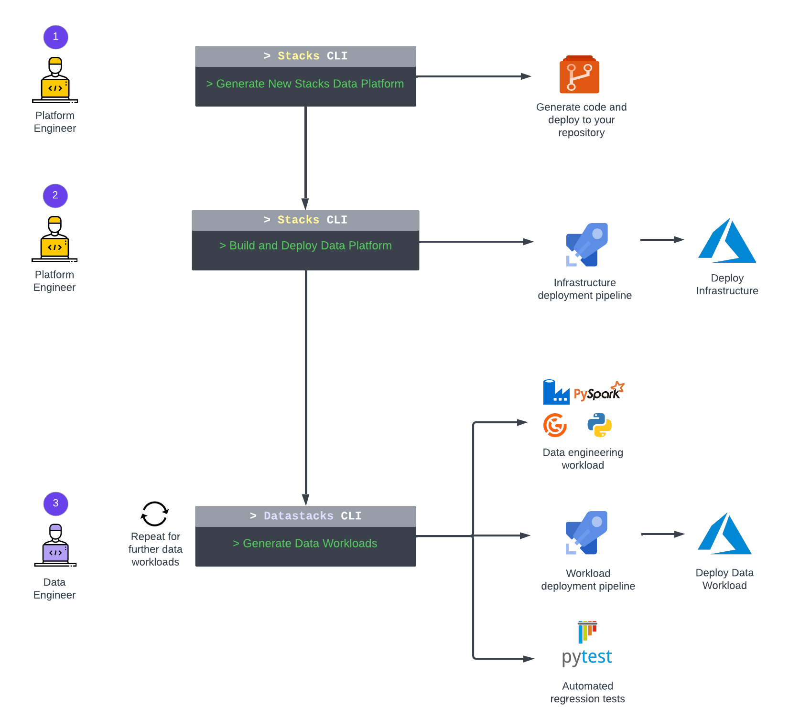
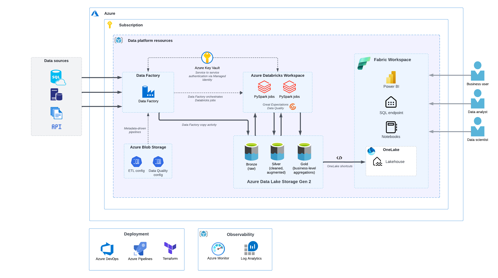

The [Ensono Stacks Azure Data Platform](https://github.com/ensono/stacks-azure-data) solution provides
a framework for accelerating the deployment of a production-ready modern data platform in Azure.

1. Use the [Ensono Stacks CLI](/docs/stackscli/about) to generate a new data platform project.
2. Build and deploy the data platform infrastructure into your Azure environment.
3. Accelerate development of data workloads and ELT pipelines with the [Datastacks CLI](./data_engineering/datastacks.md).

The Ensono Stacks Data Platform delivers a modern _Lakehouse_ solution, based upon the [medallion architecture](./data_engineering/data_engineering_intro_azure.md#medallion-architecture), with Bronze, Silver and Gold layers for various stages of data preparation. The platform utilises tools including **Azure Data Factory** for data ingestion and orchestration, **Databricks** for data processing and **Azure Data Lake Storage Gen2** for data lake storage. It provides a foundation for data analytics and reporting through **Microsoft Fabric** and **Power BI**.

Key elements of the solution include:

- Infrastructure as code (IaC) for all infrastructure components (Terraform).
- Deployment pipelines to enable CI/CD and DataOps for the platform and all data workloads.
- Sample [data ingest pipelines](./data_engineering/ingest_data_azure.md) that transfer data from a source into the landing (Bronze) data lake zone.
- Sample [data processing pipelines](./data_engineering/data_processing.md) performing data transformations from Bronze to Silver and Silver to Gold layers.

The solution utilises the [Stacks Data Python library](./data_engineering/stacks_data_utilities.md), which offers a suite of utilities to support:

- Data transformations using PySpark.
- Frameworks for [data quality validations](./data_engineering/data_quality_azure.md) and [automated testing](./data_engineering/testing_data_azure.md).
- The [Datastacks CLI](./data_engineering/datastacks.md) - a tool enabling developers to quickly generate new data workloads.

### High-level architecture

### Infrastructure deployed

- Resource Group
- Key Vault
- Azure Data Lake Storage Gen2
- Azure Blob Storage
- Azure Data Factory
- Log Analytics Workspace
- Databricks Workspace
- Azure SQL Database (optional, for testing the platform)

The deployed platform can [integrate with Microsoft Fabric](./data_engineering/data_engineering_intro_azure.md#fabric-lakehouse) to provide a suite of analytics tools and capabilities.

The solution is designed to be deployed within a secure private network - for details see [infrastructure and networking](./architecture/infrastructure_data_azure.md).

### Data Engineering workloads

Example data engineering workloads are provided, based upon the Datastacks templates:

- [Ingest](./data_engineering/ingest_data_azure.md)
- [Bronze to Silver](./data_engineering/data_processing.md)
- [Silver to Gold](./data_engineering/data_processing.md)

Each of the ingest and data processing workloads may optionally include [data quality checks](./data_engineering/data_quality_azure.md).
